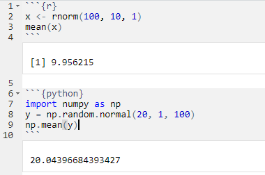
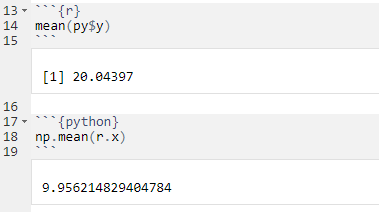
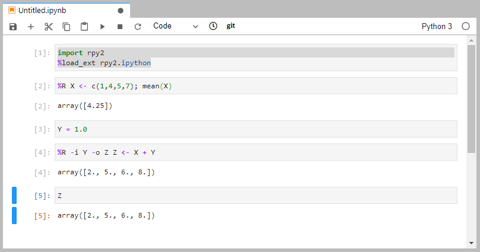

<!-- formatting help: -->
<!-- https://garrettgman.github.io/rmarkdown/ioslides_presentation_format.html -->
<!-- https://bookdown.org/yihui/rmarkdown/ioslides-presentation.html -->

```{r setup, include=FALSE}
knitr::opts_chunk$set(echo = FALSE)
# python lib for required packages not available on the system
# install e.g. using:
#    pip3 install numpy scipy rpy2 matplotlib sinfo pandas --target ./combining_python_and_R/pythonlib/ --upgrade
Sys.setenv(PYTHONPATH = "/tungstenfs/groups/gbioinfo/stadler/documents/teaching/SIB_advanced-scRNAseq-course_2020/adv_scrnaseq_2020/pythonlib")
Sys.setenv(RETICULATE_PYTHON = "/usr/bin/python3.6") # use system python 3.6
library(reticulate)
py_config()
```

## Outline

- <div class="bullet-level1">Motivation for combining R and Python</div>  

- <div class="bullet-level1">Levels of integration</div>
    * Break into homogeneous chunks  
    * Use a "bridge"  
    * Truly integrated workflow  


## Why Python or R for data science? {.smaller}

- <div class="bullet-level1">Both</div>
    * open-source programming language with a large community
    * new libraries or tools are added continuously  
    * interface to compiled language libraries
- {width=150px}
    * general purpose programming language
    * clean, efficient, modular design (software deployment)
    * scipy, scVelo, scikit-learn, Keras, PyTorch
- {width=60px} 
    * statistical modeling and data analysis language
    * great for visualization
    * Bioconductor (edgeR, DESeq2, scran, scater), tidyverse, ggplot2, shiny

## Many "Python versus R" comparisons out there... {.smaller}

<!-- - why choose if you can have both   -->
<!-- https://www.guru99.com/r-vs-python.html -->
<!-- https://www.datacamp.com/community/blog/when-to-use-python-or-r -->
<!-- http://ucanalytics.com/blogs/r-vs-python-comparison-and-awsome-books-free-pdfs-to-learn-them/ -->

<blockquote class="twitter-tweet"><p lang="en" dir="ltr">Which <a href="https://twitter.com/hashtag/superheroe?src=hash&amp;ref_src=twsrc%5Etfw">#superheroe</a> are you?(<a href="https://twitter.com/hashtag/batman?src=hash&amp;ref_src=twsrc%5Etfw">#batman</a> Vs. <a href="https://twitter.com/hashtag/Superman?src=hash&amp;ref_src=twsrc%5Etfw">#Superman</a>) == (<a href="https://twitter.com/hashtag/R?src=hash&amp;ref_src=twsrc%5Etfw">#R</a> Vs. <a href="https://twitter.com/hashtag/Python?src=hash&amp;ref_src=twsrc%5Etfw">#Python</a>)? <a href="https://twitter.com/hashtag/datascience?src=hash&amp;ref_src=twsrc%5Etfw">#datascience</a> <a href="https://twitter.com/roopamu?ref_src=twsrc%5Etfw">@roopamu</a> <a href="https://t.co/B1gO8MT1Zr">https://t.co/B1gO8MT1Zr</a> <a href="https://t.co/GR3pUiZ6rS">pic.twitter.com/GR3pUiZ6rS</a></p>&mdash; Antoine (@AntoineTrdc) <a href="https://twitter.com/AntoineTrdc/status/660953806168072193?ref_src=twsrc%5Etfw">November 1, 2015</a></blockquote> <script async src="https://platform.twitter.com/widgets.js" charset="utf-8"></script>

## Why combining the two? {.larger}

- any data scientist constantly combines tools from various sources
- unlikely that all functionality is available from a single source  
- nice to have fewer scripts / steps / intermediate files  
    <!-- * <span class="inline-code">PyTorch</span> is my favorite ML framework. -->
    <!-- * I would like to use <span class="inline-code">ggplot2</span> for plotting. -->
- use case (why I started looking into combining R and Python):
    * primarily use <span class="inline-code">R/BioC</span> for analysis of single cell data
    * want to make use of <span class="inline-code">scVelo</span> python package for RNA-velocity analysis

## Levels of integration {.smaller}

1. <div class="bullet-level1">Break into homogeneous chunks</div>
    - each chunk is pure <span class="inline-code">R</span> or pure <span class="inline-code">python</span>
    - chunks are run separately from each other
    - input and output is read from and stored in intermediate files  

2. <div class="bullet-level1">Use a "bridge"</div>  
    - primarily work with one language
    - use a <strong>specialized package</strong> that allows calling the 2nd language from the first
    <!-- - learn its syntax and object mapping and add appropriate calls   -->
    <!-- - works well for few/well encapsulated calls to second language, if required objects can be shared over "bridge" -->

3. <div class="bullet-level1">Truly integrated workflow</div>
    - use a single script or notebook
    - run it through a <strong>pair of connected R and python processes</strong>
    - <strong>objects are shared</strong> between these processes (no need for input/output files)

## Approach 1: break into pure R/python chunks

- <div class="bold-large">can be organized using workflow tools</div>
    * (make, Snakemake, knime, custom pipelines, ...)
    
- <div class="green-large">Advantages</div>
    * flexible, can combine any tool (scripts, binaries, ...)  

- <div class="red-large">Disadvantages</div>
    * no real integration
    * need to store state in intermediate files
    * need for cut-and-glue code

## Approach 2: Use a "bridge"

- <div class="bold-large">made possible by "bridge" packages</div>
    * Call python from R: [reticulate](https://rstudio.github.io/reticulate/) {width=50px}  
    * Call R from python: [rpy2](https://rpy2.github.io/) {width=40px}

- <div class="green-large">Advantages</div>
    * easy to use (primarly use one language)  
    
- <div class="red-large">Disadvantages</div>
    * indirect access to "other" language
    * need to learn bridge package syntax  

## Display conventions (also for exercises)

I will use background colors to indicate code from different languages:  
```{r, echo=TRUE, class.source = "rchunk"}
# R code
R.version.string
```

```{python, echo=TRUE, class.source = "pythonchunk"}
# python code
import sys
sys.version
```

```{bash, echo=TRUE, class.source = "bashchunk"}
# shell script (bash)
echo ${BASH_VERSION}
```

## Example: Calling python from R using [reticulate](https://rstudio.github.io/reticulate/) {data-background="figures/reticulated_python.png" data-background-size="120px" data-background-position="right bottom" data-background-repeat="no-repeat"}

```{r pythonFromR, echo=TRUE, class.source = "rchunk"}
library(reticulate)
os <- import("os")
os$listdir(".")
```

```{python, echo=TRUE, class.source = "pythonchunk"}
import os
os.listdir(".")
```

## [reticulate](https://rstudio.github.io/reticulate/) type conversions {.smaller data-background="figures/reticulated_python.png" data-background-size="120px" data-background-position="right bottom" data-background-repeat="no-repeat"}

R                      Python            Examples
---------------------  ----------------- ---------------
Single-element vector  Scalar            1, 1L, TRUE, "foo"
Multi-element vector   List              c(1.0, 2.0, 3.0), c(1L, 2L, 3L)
List of multiple types Tuple             list(1L, TRUE, "foo")
Named list             Dict              list(a = 1L, b = 2.0), dict(x = x_data)
Matrix/Array           NumPy ndarray     matrix(c(1,2,3,4), nrow = 2, ncol = 2)
Data Frame             Pandas DataFrame  data.frame(x = c(1,2,3), y = c("a", "b", "c"))
Function               Python function   function(x) x + 1
Raw                    Python bytearray  as.raw(c(1:10))
NULL, TRUE, FALSE      None, True, False NULL, TRUE, FALSE


## Example: Calling R from python using [rpy2](https://rpy2.github.io/) {data-background="figures/rpy2_logo2013.png" data-background-size="120px" data-background-position="right bottom" data-background-repeat="no-repeat"}

```{python rFromPython, eval = FALSE, echo=TRUE, class.source = "pythonchunk"}
import rpy2.robjects as robjects
pi = robjects.r['pi']
pi[0]
```
<!-- cannot evaluate the above:
     Rmarkdown has already setup reticulate to bridge R+python,
     cannot at the same time import rpy2 to bridge back!
     Fix: use the reticulate "r" object the access pi from python :-) -->
```{python, echo=FALSE}
r.pi
```

```{r, echo=TRUE, class.source = "rchunk"}
pi
```

## [rpy2](https://rpy2.github.io/) type conversions {data-background="figures/rpy2_logo2013.png" data-background-size="120px" data-background-position="right bottom" data-background-repeat="no-repeat"}

- rpy2's object conversion system is complex and powerful:
    * a lower-level interface (implemented as protocols): [rpy2.rinterface](https://rpy2.github.io/doc/latest/html/rinterface.html#module-rpy2.rinterface)  
    * a higher-level interface using converter functions: <span class="inline-code">rpy2.robjects.conversion.Converter()</span>  
    * custom converters can be implemented for new objects
- for details see: https://rpy2.github.io/doc/latest/html/robjects_convert.html


## Approach 3: Integrated workflow

- <div class="bold-large">use a single script or notebook</div>
    * use a pair of connected R and python processes
    * processes can share objects similarly as with "bridge" approach  
    <!-- * not new: Emacs org-mode, Beaker notebook (not developped anymore), ... -->
    * supported by RStudio: <span class="inline-code">rmarkdown</span> + <span class="inline-code">reticulate</span>, see also [blog post](https://blog.rstudio.com/2018/03/26/reticulate-r-interface-to-python/)
    * supported by Jupyter: [<span class="inline-code">rpy2.ipython.rmagic</span>](https://rpy2.github.io/doc/latest/html/interactive.html#module-rpy2.ipython.rmagic)  

- <div class="green-large">Advantages</div>
    * easy to use  
    * can mostly use native code  
    
- <div class="red-large">Disadvantages</div>
    * increased complexity of environment (ok once it is setup)  
    * need to learn some specific syntax (limited)  

## "I don't like notebooks"

- <div class="bullet-level2">presentation by Joel Grus at JupyterCon 2018:</div>  
    * [link to slides (Google docs)](https://docs.google.com/presentation/d/1n2RlMdmv1p25Xy5thJUhkKGvjtV-dkAIsUXP-AL4ffI/edit#slide=id.g362da58057_0_1)  
    * presentation refer to Jupyter notebooks, but applies equally to RStudio notebooks  
- <div class="bullet-level2">in a nutshell:</div>
    * possible to run chunks out of order and to have an inconsistent state (shown output is not what you would get upon rerun)
    * the hidden state makes it difficult to understand what's going on
    <!-- * it's hard to write modular code with unit tests in notebooks -->
    * better: use markdown (compiled in order, no bad surprises)

## Example: RStudio markdown

<div class="columns-2">
Code cells are declared in a header:  

{width=420px}

The special objects <span class="inline-code">r</span> and <span class="inline-code">py</span> can be used to access the "other side":  
{width=420px}
</div>

## Example: Jupyter notebook

Code cells are declared to contain R by starting with <span class="inline-code">%R</span> (single line) or <span class="inline-code">%%R</span> (multiple lines) ([details](https://rpy.sourceforge.io/rpy2/doc-dev/html/interactive.html?highlight=rmagic#module-rpy2.ipython.rmagic)):
<pre>
%R [-i INPUT] [-o OUTPUT] [...] [code [code ...]]
</pre>

{width=640px}

## {.vcenter .verylarge}

Thank you!