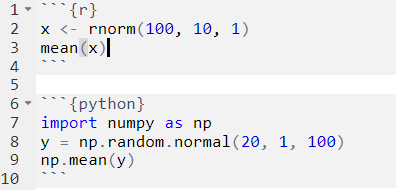
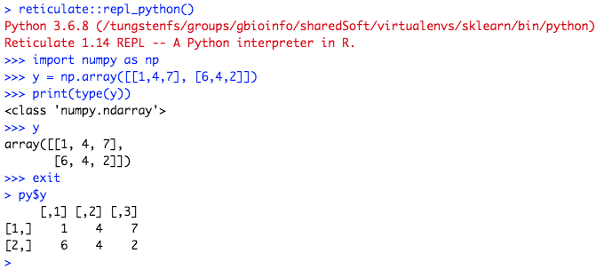

# Introduction

In this exercise, we will work with RStudio as an editor and use its support
for code from different laguages.

## Useful links

- "R Markdown: The Definitive Guide" (free online book): https://bookdown.org/yihui/rmarkdown/
- `knitr` chunk options: https://yihui.org/knitr/options/
- `reticulate` documenation (R interface to python): https://rstudio.github.io/reticulate/
- `reticulate` and sparse matrices: https://rstudio.github.io/reticulate/articles/calling_python.html#sparse-matrices-1
- `reticulate` webinar: https://resources.rstudio.com/webinars/r-python-in-rstudio-1-2-with-reticulate
- PyCon.DE 2018: "Reticulate: R Interface To Python" (presentation by Jens Bruno Wittek): https://www.youtube.com/watch?v=EJxQSa9lwfM
- Tutorial for using Python in RStudio: https://docs.rstudio.com/tutorials/user/using-python-with-rstudio-and-reticulate/
- `SciPy` documenation: https://docs.scipy.org/doc/scipy/reference/
- `pandas.DataFrame` documentation: https://pandas.pydata.org/pandas-docs/stable/reference/api/pandas.DataFrame.html
- `matplotlib` documentation: https://matplotlib.org/contents.html
- `ggplot2` documentation: https://ggplot2.tidyverse.org/


# RStudio IDE

## RStudio notebook support

Similar to Jupyter, RStudio now also supports a notebook interface (see
[link](https://bookdown.org/yihui/rmarkdown/notebook.html) for details). Code chunks
can be run independently and the output is captured and visualized already in the
editor interface. However, as pointed out during the introduction, this creates
the risk of running things out of order and creating an inconsistent state.

I will demonstrate this issue using the two code cunks below:
```{r}
x <- 2
```

```{r}
x + 1
```

While working on an `Rmarkdown` document, the ability to see immediately the output of
a newly written chunk is very convenient, and I also make use of it. A safe way
to create consistent output though is to always compile the whole document when its
finished and only share the resulting output.

## Defining code chunks 

The content of an `Rmarkdown` document (`.Rmd` file extension) is mostly `markdown`
(plain text with human-friendly formatting cues, see this [article](https://en.wikipedia.org/wiki/Markdown)
on Wikipedia). `Markdown` documents are pure text, but can be compiled into various
output formats (HTML, PDF and Word in RStudio).

In addition, `Rmarkdown` documents can contain code chunks that will be run
upon compilation, and their output (text or figures) can be captured and integrated
into the generated output file.

For code chunks, multiple languages are supported by RStudio (see
[link](https://bookdown.org/yihui/rmarkdown/language-engines.html) for a list).
Code chunks are delineated by three backticks (<span class="pre">```</span>), and
the language is defined in the header:  
{width=320px}

In addition to the language, additional options that apply to that chunk can
be defined in the header, such as:  

- `fig.width` and `fig.height` control the dimensions of generated figures
- `warnings=FALSE` suppresses warnings
- `echo=FALSE` hides the code in the output
- `eval=FALSE` does not run a code chunk
- `cache=TRUE` caches the output of a chunk (warning: beware of inconsistent state)

You can find more details
on chunk options supported by `knitr`, RStudio's default engine, [here](https://yihui.org/knitr/options/).

As mentioned in the introduction, I use different background colors to indicate
code chunks for different languages. These will only become visible in the
rendered output document and are defined in a CSS file.

```{r, eval=FALSE, class.source="rchunk"}
# R code
R.version.string
```

```{python, eval=FALSE, class.source="pythonchunk"}
# python code
import sys
sys.version
```

```{bash, eval=FALSE, class.source="bashchunk"}
# shell script (bash)
echo ${BASH_VERSION}
```


# Working with `reticulate`

{width=200px}

Combining R and Python is made possible using the [reticulate](https://rstudio.github.io/reticulate/)
package. It has been created by developers at RStudio (JJ Allaire and Kevin Ushey)
and is compatible with Python >= 2.7 and numpy >= 1.6.

It can be installed from [CRAN](https://cran.r-project.org/) using the code below
(this is not needed on your virtual machine - it is already installed):   
```{r, eval=FALSE}
install.packages("reticulate")
```


## Selecting which Python to use

The Python instance to be used by [reticulate](https://rstudio.github.io/reticulate/)
should be selected at the beginning of an analysis, before the Python process is started.

You can use `py_available()` to check if Python is available on the system and
has already been initialized, and `py_discover_config()` if you want to select
one from several potential Python instances that provides specific required modules:
```{r}
# load reticulate package
library(reticulate)

# check if Python is available and has already been initialized
py_available()

# dicsover Python that provides "numpy"
py_discover_config(required_module = "numpy")
```

By default, [reticulate](https://rstudio.github.io/reticulate/) uses the version
of Python found on your PATH (i.e. `Sys.which("python")`).
The `use_python()` function, or the `RETICULATE_PYTHON` environment variable enable
you to specify an alternate version.

You can also use Python from a virtual or Conda
environment using the `use_virtualenv()` and `use_condaenv()` functions. See
this [link](https://rstudio.github.io/reticulate/articles/versions.html) for more details.

Finally, environments can also be created, and Python packages can be installed or
removed, from within R using the following functions:  

- *Conda environments*: `conda_create()`, `conda_install()`, `conda_remove()`  
- *Virtual environments*: `virtualenv_create()`, `virtualenv_install()`, `virtualenv_remove()`
- *active environment* (or if unset, the `r-reticulate` environment): `py_install()`

For this course, the virtual machine has `RETICULATE_PYTHON` set, and all required
python packages are already installed, so that you don't have to do anything.
On my local server, which I use to write this documenation, I however have to
select a particular Python, which I do by setting `RETICULATE_PYTHON` and
library path (`PYTHONPATH`).

Finally, we can use `py_config()` to see which Python `reticulate` is using.
If you run `py_config()` and Python bindings have not been initialized yet, they
will be initialized by that function:
```{r selectPython, class.source="rchunk"}
# set python env (only needed on server xenon6)
if (Sys.info()["nodename"] == "xenon6.fmi.ch") { getwd()
    Sys.setenv(PYTHONPATH = file.path(getwd(), "pythonlib"))
    Sys.setenv(RETICULATE_PYTHON = "/usr/bin/python3.6")
}

# print config (will initialize Python bindings)
py_config()

# check if Python is available now
py_available()
```


## The `reticulate` Python engine

The integration of R and Python in RStudio is more sophisticated than that of
other languages that can be run in code chunks.
The Python engine from [reticulate](https://rstudio.github.io/reticulate/) allows you to:

1. run Python chunks (single Python session embedded within your R session, shared variables/state between Python chunks)
2. print Python output (including graphical output from [matplotlib](https://matplotlib.org/)
3. access Python objects from R (using the `py` object)
4. access R objects from Python (using the `r` object)


# Exercises

## Ways of executing Python code

There are five ways how you can run Python code from R:

1. `py_run_string()` and `py_eval()` run code provided as a string
2. `py_run_file()` runs code contained in a script file
3. `source_python()` runs code contained in a script file and imports objects into R
4. Python code chunks (only in Rmarkdown documents)
5. interactively using `repl_python()` (read-eval-print-loop)

All five evaluate the Python code in the `__main__` Python module. In contrast to
(1) and (2), (3) will in addition make all public (non-module) objects
within the main Python module available within the specified R environment.
(4) is my personal favorate, because it allows me to write native Python
code without `reticulate` specific functions. It is however only available
in an Rmarkdown document. (5) is useful to quickly try out something without
needing to recompile the Rmarkdown document.

Let's try this out:
```{r, class.source="rchunk"}
# run code in a string
py_run_string("a = [1, 2, 3]")
py_eval("len(a)")
exists("a")

# run code in a file
pytempfile <- tempfile()
writeLines("b = [4, 5, 6]", pytempfile)
py_run_file(pytempfile)
py_eval("len(b)")
exists("b")

# run code in a file and import objects into R
source_python(pytempfile)
exists("b")
b
```

This illustrates that objects are not automatically shared between R and Python
processes. Still, they can be easily accessed from the other process (see next
section).

- How would you calculate the mean of `a` and export the result
  into the R environment (find two alternative methods)?

Finally, here is how you could use `repl_python()`:




## Sharing objects between `R` and `python`

As mentioned in the introduction, [reticulate](https://rstudio.github.io/reticulate/)
automatically translates between common objects when switching the language,
as summarized in the following table:

R                      Python            Examples
---------------------  ----------------- ---------------
Single-element vector  Scalar            1, 1L, TRUE, "foo"
Multi-element vector   List              c(1.0, 2.0, 3.0), c(1L, 2L, 3L)
List of multiple types Tuple             list(1L, TRUE, "foo")
Named list             Dict              list(a = 1L, b = 2.0), dict(x = x_data)
Matrix/Array           NumPy ndarray     matrix(c(1,2,3,4), nrow = 2, ncol = 2)
Data Frame             Pandas DataFrame  data.frame(x = c(1,2,3), y = c("a", "b", "c"))
Function               Python function   function(x) x + 1
Raw                    Python bytearray  as.raw(c(1:10))
NULL, TRUE, FALSE      None, True, False NULL, TRUE, FALSE

Let's use the `r` and `py` objects to illustrate sharing of objects.

- Let's first create numerical values drawn from normal
  distributions, one in R called `x` and one in Python called `y`:

```{r, class.source="rchunk"}
x <- rnorm(100, 10, 1)
```
```{python, class.source="pythonchunk"}
import numpy as np
y = np.random.normal(20, 1, 100)
```

- Let's calculate the mean of `x` and `y`, both in R and in Python:
```{r, class.source="rchunk"}
mean(x)
mean(py$y)
```
```{python, class.source="pythonchunk"}
np.mean(r.x)
np.mean(y)
```

- Let's create a python function that calculates and returns the mean
  of its argument, and call it from R:
```{python, class.source="pythonchunk"}
def pymean(z):
    return np.mean(z)
```
```{r, class.source="rchunk"}
py$pymean(x)
py$pymean(py$y)
```


## Working with tabular data

A particularly nice capability is the built-in support for `pandas` DataFrame
objects.

- Make the R built-in data.frame `iris` available in Python as `pyiris` and print
  its column names (remark: if `pandas` is not available in Python, an R
  `data.frame` will be converted into a python `dict`)
```{r, class.source="rchunk"}
class(iris)
```
```{python, class.source="pythonchunk"}
type(r.iris)
pyiris = r.iris
pyiris.columns
```

- Calculate a concise summary of the dataframe both in R and Python:
```{r, class.source="rchunk"}
summary(iris)
```
```{python, class.source="pythonchunk"}
pyiris.info()
```

- Write `iris` from R into a csv file, read it back into `pyiris2` in Python and
  make available in R as `iris2` (note the data types of the "Species" column)
```{r, class.source="rchunk"}
fname <- tempfile()
write.csv(x = iris, file = fname, row.names = FALSE)
```
```{python, class.source="pythonchunk"}
import pandas as pd
pyiris2 = pd.read_csv(r.fname)
pyiris2.info()
```
```{r, class.source="rchunk"}
iris2 <- py$pyiris2
class(iris2)
summary(iris2)
```


## Creating figures

Plotting from Python using [matplotlib](https://matplotlib.org/) is also supported.

- Using the `iris` data frame, create a scatter plot of "Sepal.Length" versus "Petal.Length"
  with points colored by "Species", both in R and in Python. Use chunk options to
  control the size of the figures.
  
```{r, class.source="rchunk", fig.width=4.5, fig.height=5}
# base graphics
plot(iris$Sepal.Length, iris$Petal.Length, pch = 20,
     col = as.numeric(iris$Species) + 1,
     xlab = "Sepal length (mm)", ylab = "Petal length (mm)")
legend("topleft", levels(iris$Species), pch = 20, col = 2:4, bty = "n")
```

```{r, class.source="rchunk", fig.width=5, fig.height=4}
# ggplot2
library(ggplot2)
ggplot(iris, aes(x=Sepal.Length, y=Petal.Length, colour=Species)) +
         geom_point() +
         xlab("Sepal length (mm)") + ylab("Petal length (mm)")
```

```{python, class.source="pythonchunk", fig.width=4.5, fig.height=4.5}
import matplotlib.pyplot as plt

groups = pyiris.groupby('Species')

fig, ax = plt.subplots()

for name, group in groups:
    ax.scatter(x = group["Sepal.Length"], y = group["Petal.Length"], label=name)
ax.legend()

ax.set_xlabel('Sepal length (mm)', fontsize=12)
ax.set_ylabel('Petal length (mm)', fontsize=12)
```


## Sparse matrices

If [scipy](https://scipy.org/) is installed, [reticulate](https://rstudio.github.io/reticulate/) will
automatically convert R `dgcMatrix` sparse matrix objects to [SciPy CSC
matrix](https://docs.scipy.org/doc/scipy/reference/generated/scipy.sparse.csc_matrix.html) objects. Without a working [scipy](https://scipy.org/) installation, the code below will
throw a "cannot convert object" error.

```{r, class.source="rchunk"}
# load Matrix package and create sparse matrix A
library(Matrix)
i <- c(1,3:8)
j <- c(2,9,6:10)
x <- 7 * (1:7)
A <- sparseMatrix(i, j, x = x)
A
```

```{python, class.source="pythonchunk"}
# automatic conversion to SciPy CSC matrix (requires scipy)
r.A
r.A.shape
```

# Final remarks

- When sharing objects between Python and R, the object is often copied. In specific cases (e.g., numpy arrays), the object is not copied (R and Python point to the same object in memory).  
- R and Python use different default numeric types - if Python expects an integer, be sure to add L in R (e.g. `3L`).
- Keep in mind that Python uses 0-based indices, while R uses 1-based.


# Session info
It's good practise to include information on all used software and their version
at the end of the document. For R, we can use the built-in `sessionInfo()` function,
for python we can for example use the `sinfo` package:  

## R
```{r, class.source="rchunk"}
date()
sessionInfo()
```

## Python
```{python, class.source="pythonchunk"}
from sinfo import sinfo
sinfo()
```
