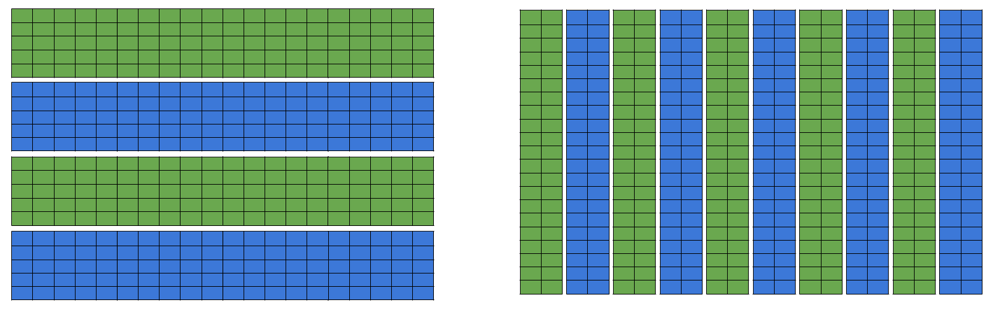

    
```{r, message=FALSE}
library(rhdf5)
library(HDF5Array)
```
    
## Reading subsets of the data

So far we've used `h5read()` or `h5dump()` to pull the entire contents of a HDF5 dataset in our R session.  However this doesn't take advantage of one of the major features of HDF5 files - efficient access to subsets of a dataset.

What happens if you try to run the code below, which reads the `counts_matrix` dataset from `brain100k.h5`?  Try using `h5ls()` to explore the size of the data.

```{r, too-large, eval = FALSE}
brain_data <- h5read(file = "../data/on-disk-data//brain100k.h5", name = "/counts_matrix")
```

Sometimes data are simply too large to read into memory.  This 100,000 cell matrix is actually a subset of a larger, 1.3 million cell 10X dataset.  Naively reading the complete set of counts into a dense R matrix requires ~ 150GB of RAM.

We can use the `index` argument to specify the elements we want to extract from our dataset.  The syntax is a little strange for R, and should be a list with the same length as the number of dimensions in our dataset - in our case that's two.  Each element of the list is a vector providing the indices you want to read or `NULL` to read everything in that dimension.  In the example below we will read all the rows and the first five columns.

```{r, reading-subset}
brain_data_subset <- h5read(file = "../data/on-disk-data//brain100k.h5", name = "/counts_matrix", index = list(NULL, 1:5))
```

### *Exercise*

Can you modify the code to read other sets of columns?  Instead of reading the first five columns try reading the last five or columns 50,001 - 50,005.  You can also experiment reading a larger number of columns - perhaps 100, 1,000 or 10,000.  Use `system.time()` to examine how long reading these subsets takes.

```{r, eval = FALSE}
## Insert your own code here
```

Hopefully you found that it takes a very similar amount of time to read five consecutive columns from anywhere in the file.  You should also notice that the time taken to read larger numbers of columns scales fairly linearly with the number of columns you want.

In this case where our HDF5 file just contains a counts matrix, the HDF5Array approach works equally well.

```{r, reading-subset-hdf5a}
HDF5Array::HDF5Array(filepath = "../data/on-disk-data//brain100k.h5", name = "/counts_matrix")
```

### Exercise

How does the timing scale with HDF5Array?


## Exploring the effect of chunk layout

We've established that the chunked nature of HDF5 datasets provides efficient access to subsets of that data.  The story is actually more nuanced than this, as HDF5 allows a user to control the size and shape of the chunks when the file is created, which can have a great impact on the performance of any later read operations.

```{r, chunk-layout-fig, echo = FALSE, fig.cap='In HDF5 datasets can be stored as "chunks" on disk, and if only a subset of data is required only the necessary chunks need to be read.  Chunk layout doesn\'t have to be symetrical in every dimension, in the 2-dimensional dataset above chunks can consist of entire rows, entire columns, or any other regular partitioning.', fig.show = 'hold', out.width="100%"}
knitr::include_graphics('images/Chunk_layout_1.png')

```

We're going to write the same data multiple times, and take a look at how this effects the read performance.  First, lets get hold of a 10,000 cell matrix.

```{r, eval = TRUE}
brain_10k <- as.matrix(HDF5Array(file = "../data/on-disk-data/brain100k.h5", name = "/counts_matrix")[,1:10000])
dim(brain_10k)
```

rhdf5 doesn't provide access to the chunk dimension settings in `h5write()`.  Instead we have to use a two-step process, creating an empty dataset with `h5createDatatset()` and then writing to that with `h5write()`.  Here we create the dataset to consist of one single, very large, chunk.


```{r, eval = TRUE}
h5createFile(file = "../data/on-disk-data/one_chunk.h5")
h5createDataset(file = "../data/on-disk-data/one_chunk.h5", 
                dataset = "one_chunk", 
                dims = dim(brain_10k), 
                storage.mode = "integer",
                chunk = c(nrow(brain_10k), ncol(brain_10k)))
h5write(brain_10k, file = "../data/on-disk-data/one_chunk.h5", name = "one_chunk")
```

### Exercise

Try creating other datasets with different chunk sizes.  You can pick whatever you like, but I suggest trying square chunks as well as the extremes of single-row or single-column chunks.  You can then again use `system.time()` to see how long it takes to read five columns:


```{r timing-chunks, results = "hold"}
system.time( h5read(file = "../data/on-disk-data/one_chunk.h5", name = "/one_chunk", index = list(NULL, 1:5)) )
```


We can also look at the file size to get an idea of how the compression is affected.


