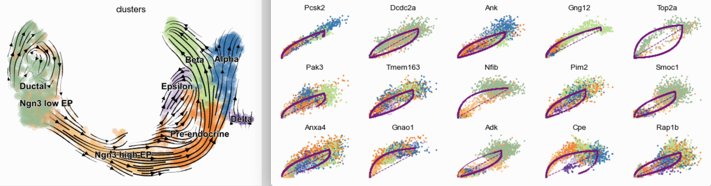
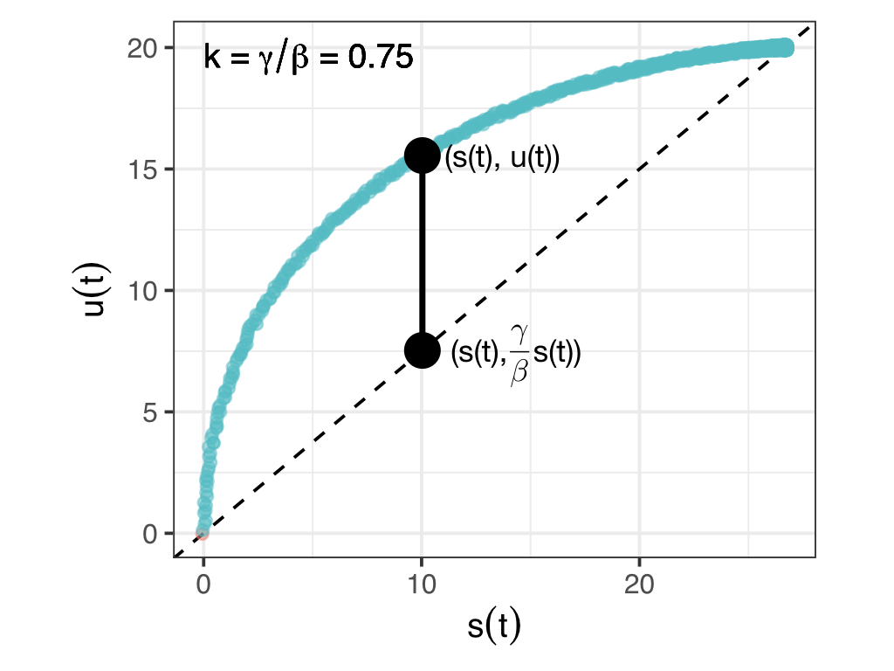
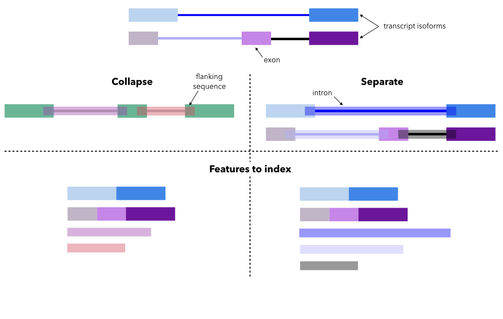
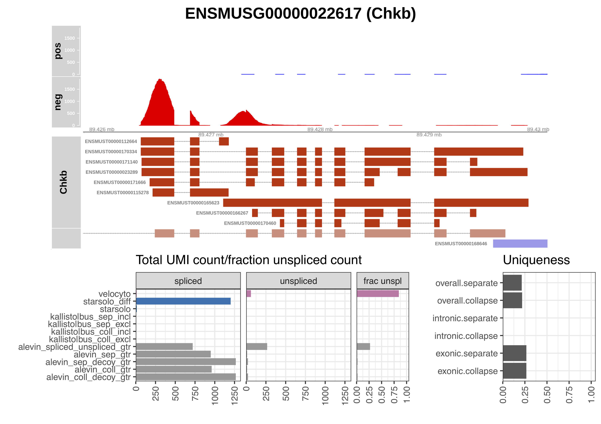
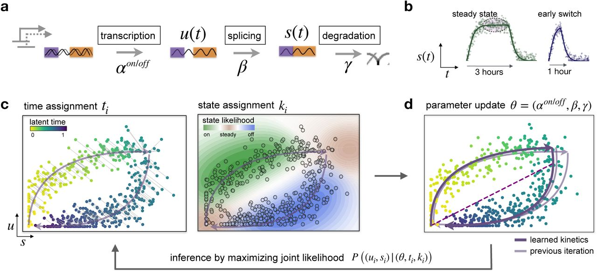

<style type="text/css">
.pythonchunk {
background-color: #faf2dc !important;
}
.rchunk {
background-color: #f5f5f5 !important;
}
.bashchunk {
background-color: #e3eefa !important
}
</style>


# Introduction and structure

In this part of the course, we will discuss _RNA velocity_ estimation. 
We will cover the underlying mathematical model and assumptions, how the raw data can be quantified in a suitable way, and how the velocity values are estimated and interpreted.

This section uses both R, Python and bash commands. 
The language is indicated by the background color of the respective code chunks. 
R code is represented by <span style="background-color:#f5f5f5">grey</span> boxes, shell commands by <span style="background-color:#e3eefa">blue</span> boxes, and python code by <span style="background-color:#faf2dc">yellow</span> boxes.
Chunks containing output are always white.

# RNA velocity

The gene expression profile of a cell often gives a good indication of the current state of the cell. 
However, being a single snapshot in time, it does not tell us in which _direction_ the cell is heading, or in what state it will be at some point in the near future, and thus it may not be ideal for studying dynamical aspects of biological systems.
_RNA velocity_ (introduced by @La_Manno2018-velocyto) is one approach to addressing this gap, still using a single snapshot of a population of cells and thus without the need to be able to follow the transcriptome of a single cell over time, which is not possible with current scRNA-seq protocols.
In practice, RNA velocity analyses are often summarized by plots such as those shown below (from the [scVelo tutorial](https://scvelo.readthedocs.io/DynamicalModeling.html)): on the left, a vector field overlaid on a low-dimensional embedding, visualizing the 'flow' encoded by the velocities, and on the right, phase plots illustrating single genes.
We will see in this lecture how to generate such plots from raw droplet scRNA-seq data, and how to interpret the results.



The RNA velocity is defined as the rate of change of the mature RNA abundance in a cell, and can be estimated from scRNA-seq data by joint modeling of estimated unspliced (pre-mRNA) and spliced (mature mRNA) abundances.
This exploitation of the underlying molecular dynamics of the process sets it apart from other approaches for trajectory analysis, which typically use the similarity of the estimated gene expression profiles among cells to construct a path through the observed data. 
A thorough review of such trajectory inference methods was recently performed by @Saelens2019-trajectory.

The feasibility of the RNA velocity approach is based on the observation by @La_Manno2018-velocyto that, with several commonly used scRNA-seq library preparation protocols, not only exonic, but also intronic and exon/intron boundary-spanning reads are observed, and the insight that considering these in combination with the exonic reads would allow for inference of developmental relationships among cells. 
Similar observations, coupled with a simple differential equation model of transcriptional dynamics, have previously been used for investigation of pre-mRNA dynamics and transcriptional and post-transcriptional regulation of gene expression in exon arrays [@Zeisel2011-premrna] and bulk RNA-seq [@Gaidatzis2015-eisa], as well as estimation of transcription, processing and degradation rates in bulk RNA-seq [@Gray2014-snapshotseq].

## Mathematical model - formulation

Let 

* $u(t)$ denote the abundance of unspliced pre-mRNA
* $s(t)$ denote the abundance of mature mRNA

for a given gene in a given cell at time $t$. 
The system of differential equations underlying the RNA velocity calculations, as formulated by @Zeisel2011-premrna and used in _scVelo_ [@Bergen2019-scvelo], is as follows: 
$$\frac{du(t)}{dt}=\alpha_k(t)-\beta u(t)\\\frac{ds(t)}{dt}=\beta u(t)-\gamma s(t)$$

Let's first break this down a bit: the first equation states that the amount of unspliced RNA increases with a rate $\alpha_k(t)$; this is the rate of transcription, which depends on the _state_ that the gene is in in this particular cell at time $t$ (represented by the index $k$). 
At the same time, due to splicing the unspliced RNA abundance decreases with a rate that is proportional to the current abundance, with a proportionality constant $\beta$, the splicing rate. 

The second equation similarly states that the spliced RNA abundance increases via splicing, with the same amount as the unspliced abundance decreases, and further decreases via degradation, with a proportionality constant $\gamma$. 
The **RNA velocity** of this gene at a given time point $t$, in a given cell, is defined as the value of $ds(t)/dt$, that is, the instantaneous rate of change of the mature mRNA abundance at time $t$. 

## Mathematical model - solution

We can obtain an analytical solution to this set of equations, that is, we can derive an expression for the value of $u(t)$ and $s(t)$ at each point in time (see e.g., @Bergen2019-scvelo). 
To get a better understanding for the model, we will inspect this solution for a few different values of $\alpha_k(t)$, $\beta$ and $\gamma$.
Note that this system of equations is solved separately for _each gene_, so the solutions visualized below represent the abundances for a single gene over time. 

### Constant transcription

First, we consider the case where $\alpha$ is constant over the considered time span.
Also $\beta$ and $\gamma$ are considered to be constant rates. 
We also assume that $u_0=u(0)=0$ and $s_0=s(0)=0$, so that at time 0, this gene is not expressed.
The figures below show three different aspects of the model:

* The lower left panel illustrates the value of $\alpha$ as a function of time. 
* The upper left panel shows the value of $u(t)$ and $s(t)$ as functions of time. 
* The right panel shows a phase plot, with $s(t)$ and $u(t)$ plotted against each other. Each dot corresponds to one time point, and the points have been slightly jittered for better visibility.

<!-- -->

The first thing we notice is that as the gene starts being transcribed (small values of $t$), both the unspliced and the spliced abundances start increasing.
As expected, the unspliced abundance increases first, followed a bit later by the spliced abundance (since the latter has to go via the unspliced state).

Next, we note that as time passes, both $u(t)$ and $s(t)$ reach a steady state, or equilibrium. 
This indicates that for both the unspliced and spliced pool of molecules, the "influx" is equal to the "outflux", and as a consequence, both $du(t)/dt$ and $ds(t)/dt$ are 0. 
In other words, in this stage, the RNA velocity ($ds(t)/dt$) is zero. 
The exact levels of $u(t)$ and $s(t)$ in the equilibrium phase depend on the values of the parameters $\alpha$, $\beta$ and $\gamma$, but the overall pattern is the same.

Let's see what this looks like in the phase plot on the right hand side. 
The equilibrium point is represented in the top right corner of this plot, and the times leading up to this equilibrium are represented by the points above the diagonal line. 
We can derive the slope of the diagonal line by considering the system of equations above. 
As we saw, in the equilibrium, $$\frac{ds(t)}{dt}=0,$$and thus $$\beta u(t)=\gamma s(t).$$ 
Hence, $$u(t)=(\gamma/\beta) s(t),$$and the slope of the line (assuming that it passes through (0,0), which represents the initial condition) is $\gamma/\beta$.

How can we use this observation in order to estimate RNA velocities when we don't know the values of $\gamma$ and $\beta$ in advance, and need to estimate them from the data? 
Let's assume that the system we are studying is such that we will eventually reach the steady state (we'll see below an example of when this assumption may fail).
Of course, in practice we don't have a time course of abundances of this gene for a single cell, but we have multiple cells, and at our particular snapshot in time, these cells will likely be at different points along the trajectory (corresponding to different values of the underlying time $t$).
Thus, if we assume that the model parameters are the same for all cells (shared splicing and degradation rates), we will still get a phase plot similar to the one above, but each point would correspond to a distinct cell. 
If we then restrict our attention to the cells in the top right corner and bottom left corner of the plot (those assumed to be in steady state), we can estimate the value of $\gamma/\beta$ as the slope of a straight line fitted to these "extreme quantile" data points. 

This is, in essence, the idea behind the approach taken by @La_Manno2018-velocyto and implemented in the _velocyto_ software, and also in the 'steady-state' model in _scVelo_. 
If we fix one of the parameter values (e.g., setting $\beta=1$ as in @La_Manno2018-velocyto, corresponding to an assumption of a shared splicing rate between genes) we can estimate the other one ($\gamma$), and consequently obtain an estimate of the RNA velocity $v$, since $$v=\frac{ds(t)}{dt}=\beta u(t)-\gamma s(t).$$
Notably, these velocities can be derived directly from the phase plot: 



Consider any point along the trajectory. 
By construction, the y coordinate of this point is equal to $u(t)$. 
At the same time, the y coordinate of the diagonal line for the corresponding value of $s(t)$ is $(\gamma/\beta)s(t)$, and thus the difference between the two (the vertical displacement of the point on the trajectory from the diagonal line defined by the steady state) is $$u(t)-\frac{\gamma}{\beta}s(t),$$which is proportional to the velocity as defined above (and, in fact, equal if $\beta=1$).

Once velocities have been estimated, approximate abundances at a future time point $t+\Delta t$ can be estimated e.g. by assuming that the velocity stays constant for this time period: $$s(t+\Delta t) = s(t) + v\Delta t.$$ 

### Transient transcription

Next, let's consider another example, where instead of a constant transcription we consider a transient pattern, where $\alpha>0$ for some time before going back to zero. 

<!-- -->

Here, we observe the same type of increase in $u(t)$ and $s(t)$ in the beginning of the time course (of course, the system doesn't know that $\alpha$ will go down to zero in the future). 
When transcription is turned off, both $u(t)$ and $s(t)$ decrease in an exponential fashion. 
Again, the unspliced abundance decreases first, followed by the spliced abundance. 

In the phase plot to the right, we get the same type of pattern as previously for the induction phase (in green). 
Recall that the diagonal line corresponds to the steady-state situation, where $ds(t)/dt = 0$. 
Points above this line represent an induction of gene expression, where the unspliced abundance is higher than the spliced abundance (relative to what we expect under equilibrium). 
Similarly, points below the line (here, in blue), represent a decrease of gene expression, where there is relatively low amounts of unspliced RNA compared to what would be expected under steady state. 

Just as in the case above, if we now assume that each point represents a single cell, we can estimate the ratio $\gamma/\beta$ based on the cells in the top-right and bottom-left parts of the phase plot. 
We can also estimate velocities in the same way as described previously; points above the diagonal line will have positive velocities (induction) and points below the diagonal line will have negative velocities (repression). 

### Short transient transcription

Finally, let's consider a case with the same type of transient transcription as above, but with a much shorter duration. 

<!-- -->

Now, there is not enough time to reach the steady state. 
This complicates the estimation of $\gamma/\beta$ based on the phase plot - if we use the points in the upper right part of the plot we will overestimate the ratio. 
In _velocyto_, special approaches are implemented to estimate velocities for genes where all cells are far from steady state.
_scVelo_, instead, implements also a dynamical model, where the full dynamics of the splicing kinetic are solved, thus avoiding the reliance on cells in the steady state to base the estimation of $\gamma/\beta$ on. 
We will discuss the dynamical model in more detail later in this lecture. 


<!-- While the RNA velocity in itself may be hard to interpret, and furthermore we will have one estimate per gene and cell in our data snapshot, a powerful way of using the estimated velocities is to combine them with the current estimates of the processed RNA abundances, and thereby reconstruct the state of the cell at a timepoint in the near future.  -->
<!-- Comparison of these predicted states with the current states of all other cells allows us to infer a developmental order of the cells in our data set, which is typically how RNA velocity is currently used in practice.  -->

## Input data

To solve the system of differential equations, or estimate the velocities, we need to input both spliced (mature mRNA) and unspliced (pre-mRNA) abundances for the genes across all our cells. 
Note that this is not what is typically output from gene expression quantification pipelines (as discussed yesterday), and thus we need a dedicated quantification approach for RNA velocity applications.

### Software tools - overview

Several software packages are able to provide quantifications suitable for RNA velocity analyses. 
Just as for gene expression estimation, the software of choice depends on the scRNA-seq protocol. 
For protocols including UMIs, the software of course needs to be able to handle UMI counting. 
For full-length protocols without UMIs, on the other hand, it is common to use software developed for bulk RNA-seq data. 
Here, we focus on droplet-based protocols with UMIs, such as those provided by 10x Genomics. 
For such data, the most widely used software tools for estimating spliced and unspliced abundances are 

* _velocyto_ [@La_Manno2018-velocyto], the original implementation of the RNA velocity pipeline. Accepts bam files with reads aligned to the genome, e.g., from _CellRanger_ [@Zheng2017-10x].
* _STARsolo_ [@Dobin2013-star], the 'single-cell mode' of the STAR aligner. Operates directly on the raw FASTQ files. 
* _alevin_ [@Srivastava2019-alevin], which is part of _Salmon_ [@Patro2017-salmon], and which you saw already yesterday. Also operates directly on the FASTQ files.
* _kallisto|bustools_, or the _kb-python_ wrapper [@Melsted2019-bustools; @Melsted2019-kb], which leverages _kallisto_ [@Bray2016-kallisto] for quantification of droplet single-cell data. Also operates directly on the FASTQ files. 

Each of these have their own characteristic features, and the quantifications (and subsequent velocities) will depend on the chosen quantification method (see e.g. @Soneson2020-rnavelocity). 

### Software tools - reference sequence

One important characteristic that differ between the software tools just mentioned is the type of reference sequence they operate with. 
_velocyto_ and _STARsolo_ align the reads (or assume that the reads are aligned) to the reference genome, while _alevin_ and _kallisto|bustools_ instead map the reads to an 'expanded' transcriptome. 
The 'expansion' here refers to the inclusion of some form of unspliced or intronic sequences, which are used to represent the pre-mRNA features. 

The genome alignment-based methods (_velocyto_ and _STARsolo_) consider the position where reads are mapped to the genome, and compare those to the positions of annotated exons and introns. 
Reads aligning completely within unambiguously exonic regions are considered 'exonic' (or 'spliced'), and those aligning completely within unambiguously intronic regions are considered 'intronic' (or 'unspliced'). 
Reads overlapping multiple genes are typically discarded. 
All remaining reads, which align in regions that can be either exonic or intronic depending on which isoform one considers, are assigned or discarded as ambiguous according to a (sometimes intricate) set of rules.
The _velocyto_ software, for example, provides several such sets of rules, differing in their 'permissiveness' in allowing ambiguous reads. 

For the transcriptome alignment-based methods (_alevin_ and _kallisto|bustools_), several choices have to be made by the user in order to build the expanded transcriptome to which the reads will be aligned. 
The first decision concerns whether to estimate the pre-mRNA abundances ($u(t)$) as the abundances of the full, unspliced pre-mRNA molecules, or rather (as for the genome alignment-based methods) as the abundance of the _intronic_ parts of a gene. 
This choice has an impact on the resulting quantifications, and the determination of the 'most suitable' approach is still an area of active research and possibly depends on the protocol. 
For 3' tag data such as those from 10x Genomics protocols, initial investigations suggest that there may not be enough information to infer reliably whether fully exonic reads stem from the spliced or the unspliced RNA molecule [@Soneson2020-rnavelocity]. 
For full-length protocols, the situation may be different. 
For this reason, below we will focus on methods defining the pre-mRNA abundance as the abundance of the intronic regions. 

#### Definition of intronic regions

Let's consider the gene in the figure below. 



It has two transcript isoforms, one with two exons and one with three exons. 
The isoforms are partly overlapping. 
While the transcript sequences are straightforward to determine (and also directly provided in the reference transcriptome fasta file), the introns are more ambiguous. 
Essentially we have two choices: either we define the introns separately for each isoform, or we first collapse the isoforms into the union of their exonic regions, and define the introns as the regions that are within the gene locus, but not included in the exon union.

As you can see in the two illustrations above, with the "separate" approach the introns of a gene can overlap with each other and with the exonic regions, while this is not allowed in the "collapse" approach. 
Another way to see this is that with the "separate" approach we are considering exons and introns on an equal footing, whereas with the "collapse" approach reads in ambiguous regions will be considered exonic. 

Since 'intronic' reads can be either fully intronic or partly exonic and partly intronic (overlapping an exon/intron boundary), we add a flanking sequence to each extracted intron to allow for the latter type of reads. 
The length of this flanking sequence can be anywhere up to the length of the RNA read minus 1, depending on how much intronic overlap we want to require in order for a read to be considered potentially intronic. 

In the lower part of the figure above, we summarize the features (transcripts + introns) that will be indexed for each of the two approaches. 
In each case, the 'spliced' abundance of the gene is defined as the sum of the abundances of the individual transcripts, and the 'unspliced' gene abundance is defined as the sum of the abundances of the introns.

### Software tools - other characteristics

There are also differences between the quantification tools listed beyond their choice of reference sequence to align or map the reads to. For example:

* Only _alevin_ will consider reads that could stem from more than one gene in the quantification, while the other tools will discard these reads.
* _kallisto|bustools_ does not take into account the strandedness of the reads (e.g., from 10x Genomics), and thus quantifies the abundances as if the library was unstranded. 
This has several consequences for the quantification. 
First, consider the stituation of a gene overlapping another gene on the opposite strand. 
Reads falling in the overlapping region will be considered ambiguous, and discarded, although the fact that the 10x Genomics libraries are stranded would have allowed them to be unambiguously assigned. 
On the other hand, counting reads from both strands allow the inclusion of intronic reads stemming from discordant 'internal priming' on polyT sites. 
This phenomenon was observed by @La_Manno2018-velocyto, and suggests that in addition to the expected peaks around intronic polyA sites, there are also peaks with reads on the opposite strand, around polyT sites. 
If only reads aligning to the same strand as the introns are counted, all these peaks are discarded. 

In order to better understand some of these differences, we show below a few examples where different methods provide different quantifications (from @Soneson2020-rnavelocity):

* Chkb - overlapping features on the same strand. In this case, only _alevin_ assigns a non-zero UMI count (and _STARsolo-diff_, which defines the intronic count as the difference between a "gene body count" and the regular gene expression). 



* Rassf1 - overlapping features on different strands. 
Whether or not the tool accounts for the strandedness of the reads makes a difference.


* Tspan3 - many ambiguous regions. 
The way that the introns are defined makes a substantial difference. 
The intronic count is much higher with the 'separate' intron definition approach.


These differences between counts obtained by different methods propagate also to the estimated velocities, and can affect the biological interpretation of the final results. 

# Practical workflow

In this tutorial, we show how the 'spliced' and 'unspliced' count matrices can be generated using [_alevin_](https://salmon.readthedocs.io/en/latest/alevin.html) [@Srivastava2019-alevin] and [_tximeta_](https://bioconductor.org/packages/tximeta/) [@Love2020-tximeta].
We then illustrate how the processed data can be read into python and used as input for RNA velocity estimation with [_scVelo_](https://scvelo.readthedocs.io/) [@Bergen2019-scvelo].
It is worth keeping in mind that this is _not_ the only way that these steps can be performed, that this is a very active research area, and that it's plausible that some of the recommendations below will need to be updated as we learn more about this field and as software packages are developed further. 
However, the conceptual overview of the different steps and the guidance on the interpretation of the output is still applicable. 

Recall that the code blocks represent both R, python and bash commands, and the language is indicated by the background color of the respective code chunks. 
R code is represented by <span style="background-color:#f5f5f5">grey</span> boxes, shell commands by <span style="background-color:#e3eefa">blue</span> boxes, and python code by <span style="background-color:#faf2dc">yellow</span> boxes.
Chunks containing output are always white.

## Preparation

We start by loading the R packages that we will need for the analyses that follow. 
All packages are available via [CRAN](https://cran.r-project.org/) or [Bioconductor](https://bioconductor.org/) (>=3.11), and can be installed via 


```{.r .rchunk}
if (!requireNamespace("BiocManager", quietly = TRUE))
    install.packages("BiocManager")
BiocManager::install("<packagename>")
```


```{.r .rchunk}
suppressPackageStartupMessages({
    library(Biostrings)
    library(BSgenome)
    library(eisaR)
    library(GenomicFeatures)
    library(SummarizedExperiment)
    library(SingleCellExperiment)
    library(tximeta)
    library(rjson)
    library(reticulate)
    library(scater)
    library(scran)
    library(fishpond)
})
```

We will practice generating the [_Salmon_](https://salmon.readthedocs.io/en/latest/salmon.html) index required for _alevin_ quantification using the same small reference files that you used yesterday to create the index for the regular gene expression quantification. 
Here, we first set the path to the data (`datadir`), as well as to the folder where we will store the generated index and quantifications (`outdir`).


```{.r .rchunk}
if (file.exists("/work/adv_scrnaseq_2020")) {
  datadir <- "/work/adv_scrnaseq_2020/data/spermatogenesis_subset"
  outdir <- "/work/adv_scrnaseq_2020/data/spermatogenesis_subset/txintron"
} else {
  datadir <- "data/spermatogenesis_subset"
  outdir <- "data/spermatogenesis_subset/txintron"
}
dir.create(outdir, showWarnings = FALSE, recursive = TRUE)
Sys.setenv(datadir = datadir, outdir = outdir)
```


```{.bash .bashchunk}
## If run in a console
## datadir=/work/adv_scrnaseq_2020/data/spermatogenesis_subset
## outdir=/work/adv_scrnaseq_2020/data/spermatogenesis_subset/txintron
## Check what is included in the data directory
ls $datadir
```

```
## AdultMouseRep3sub1M_S1_L001_R1_001.fastq.gz
## AdultMouseRep3sub1M_S1_L001_R2_001.fastq.gz
## GRCm38.gencode.vM21.chr18.chr19.genome.fa
## GRCm38.gencode.vM21.chr18.chr19.gtf
## GRCm38.gencode.vM21.chr18.chr19.tgMap.txt
## GRCm38.gencode.vM21.chr18.chr19.txome.fa
## txintron
```

## Velocity quantification with _alevin_

### Step 1. Generate reference fasta files

In order to quantify both exonic and intronic abundances with _alevin_, we need to provide a reference fasta file with both types of sequences, as discussed previously. 
Several R/Bioconductor packages implement the extraction of transcript and intron sequences from the genome sequence. 
Here, we will use the [_eisaR_](https://bioconductor.org/packages/eisaR/) package, but equivalent functionality is available in the [_BUSpaRse_](https://bioconductor.org/packages/BUSpaRse/) package, and can be replicated e.g. using basic functions from the [_GenomicFeatures_](https://bioconductor.org/packages/GenomicFeatures/) and [_BSgenome_](https://bioconductor.org/packages/BSgenome/) packages. 

The first step in the feature extraction with _eisaR_ is to extract a `GRangesList` object containing the genomic coordinates of each annotated transcript and intron. 
In this example, we use the "separate" approach to define introns separately for each transcript, and add a flank length of 90nt to each intron, since the RNA read length of this data set is 91nt.


```{.r .rchunk}
grl <- eisaR::getFeatureRanges(
  gtf = file.path(datadir, "GRCm38.gencode.vM21.chr18.chr19.gtf"),
  featureType = c("spliced", "intron"), 
  intronType = "separate", 
  flankLength = 90L, 
  joinOverlappingIntrons = FALSE, 
  verbose = TRUE
)
```

```
## Import genomic features from the file as a GRanges object ... OK
## Prepare the 'metadata' data frame ... OK
## Make the TxDb object ... OK
## 'select()' returned 1:1 mapping between keys and columns
## Extracting spliced transcript features
## Extracting introns using the separate approach
```

The resulting object is a `GRangesList`, each element of which is a feature (transcript or intron) to be indexed.
Transcripts can be either mono-exonic or multi-exonic; for the latter, the corresponding entry in the `GRangesList` has multiple ranges.
Introns are always "mono-exonic". 
The feature ID of an intron will be set to `<transcript_id>-I<intron_number>` (or just `<transcript_id>-I` for the first intron in the transcript) with the 'separate' approach. 
With the 'collapse' approach, the `-I<intron_number>` suffix will instead be prefixed by the gene ID. 
For each feature, in addition to the range information _eisaR_ returns a gene ID. 
For introns, this will be the original gene ID, with a suffix `-I`. 
This is required for _alevin_ later, since it will aggregate counts on the gene level, and we want to get a separate count for the exonic and intronic features of each gene. 


```{.r .rchunk}
head(grl, 2)
```

```
## GRangesList object of length 2:
## $ENSMUST00000234132.1
## GRanges object with 1 range and 5 metadata columns:
##       seqnames          ranges strand |              exon_id exon_rank
##          <Rle>       <IRanges>  <Rle> |          <character> <integer>
##   [1]    chr18 3015908-3016159      + | ENSMUSE00001453483.1         1
##              transcript_id              gene_id        type
##                <character>          <character> <character>
##   [1] ENSMUST00000234132.1 ENSMUSG00000117547.1        exon
##   -------
##   seqinfo: 2 sequences from an unspecified genome; no seqlengths
## 
## $ENSMUST00000181558.2
## GRanges object with 2 ranges and 5 metadata columns:
##       seqnames          ranges strand |              exon_id exon_rank
##          <Rle>       <IRanges>  <Rle> |          <character> <integer>
##   [1]    chr18 3336680-3337178      + | ENSMUSE00001167652.2         1
##   [2]    chr18 3365927-3366863      + | ENSMUSE00001111527.1         2
##              transcript_id              gene_id        type
##                <character>          <character> <character>
##   [1] ENSMUST00000181558.2 ENSMUSG00000097746.2        exon
##   [2] ENSMUST00000181558.2 ENSMUSG00000097746.2        exon
##   -------
##   seqinfo: 2 sequences from an unspecified genome; no seqlengths
```

```{.r .rchunk}
tail(grl, 2)
```

```
## GRangesList object of length 2:
## $`ENSMUST00000235987.1-I1`
## GRanges object with 1 range and 5 metadata columns:
##       seqnames            ranges strand |                 exon_id exon_rank
##          <Rle>         <IRanges>  <Rle> |             <character> <integer>
##   [1]    chr19 61227095-61228428      - | ENSMUST00000235987.1-I1         1
##                 transcript_id                gene_id        type
##                   <character>            <character> <character>
##   [1] ENSMUST00000235987.1-I1 ENSMUSG00000059326.7-I        exon
##   -------
##   seqinfo: 2 sequences from an unspecified genome; no seqlengths
## 
## $`ENSMUST00000237169.1-I`
## GRanges object with 1 range and 5 metadata columns:
##       seqnames            ranges strand |                exon_id exon_rank
##          <Rle>         <IRanges>  <Rle> |            <character> <integer>
##   [1]    chr19 61232442-61232793      - | ENSMUST00000237169.1-I         1
##                transcript_id                gene_id        type
##                  <character>            <character> <character>
##   [1] ENSMUST00000237169.1-I ENSMUSG00000117740.1-I        exon
##   -------
##   seqinfo: 2 sequences from an unspecified genome; no seqlengths
```

Let's see how many transcripts and introns there are among the features (recall that introns have a `-I` in their name)


```{.r .rchunk}
table(grepl("-I", names(grl)))
```

```
## 
## FALSE  TRUE 
##  7895 40864
```

This shows that most of the features are in fact introns, as we might expect, since a single transcript can contribute multiple introns. 
As a further sanity check we can control that there are the same number of transcript features as in the transcriptome fasta file from GENCODE (also subset to chromosomes 18 and 19):


```{.r .rchunk}
txome <- Biostrings::readDNAStringSet(
  file.path(datadir, "GRCm38.gencode.vM21.chr18.chr19.txome.fa")
)
length(txome)
```

```
## [1] 7895
```

The `grl` object contains the genomic ranges for the features, but _Salmon_ needs a fasta file with sequences for the indexing. 
Thus, given the positional information and the genome sequence, we extract these sequences and write them to a fasta file for later indexing with _Salmon_.


```{.r .rchunk}
genome <- Biostrings::readDNAStringSet(
  file.path(datadir, "GRCm38.gencode.vM21.chr18.chr19.genome.fa")
)
names(genome) <- sapply(strsplit(names(genome), " "), .subset, 1)
genome
```

```
## DNAStringSet object of length 2:
##        width seq                                            names               
## [1] 90702639 NNNNNNNNNNNNNNNNNNNNNN...NNNNNNNNNNNNNNNNNNNNN chr18
## [2] 61431566 NNNNNNNNNNNNNNNNNNNNNN...NNNNNNNNNNNNNNNNNNNNN chr19
```

```{.r .rchunk}
seqs <- GenomicFeatures::extractTranscriptSeqs(
  x = genome, 
  transcripts = grl
)
seqs
```

```
## DNAStringSet object of length 48759:
##          width seq                                          names               
##     [1]    252 CCTTAACCATAGGTACAGGTA...CTTCTCCTGCCCACGTAGCC ENSMUST00000234132.1
##     [2]   1436 GATCGGCCCCCGTTTCACACT...TTCAGCGATTACTTCAAACT ENSMUST00000181558.2
##     [3]   6745 ACACCGGCACCAGGGCTCCAG...TTTGAGATTCTATAGCCAAG ENSMUST00000234647.1
##     [4]   3727 ATTGCATCCTGCGGGTGTGTG...TATTAAATTAAGTCATAACC ENSMUST0000002507...
##     [5]   2799 GGTGGCCGGCCGGGGAGGCGG...ACATGATGTTGCTGCTTGTC ENSMUST0000008008...
##     ...    ... ...
## [48755]   1153 AAGAGGAAGCGGGAGACAGAC...TTCCGGGAACTCAGGCCCTT ENSMUST0000023548...
## [48756]    283 ACCTGGGCCTGCGACACCGCC...GCACGGTCGGGGGCGCGGCC ENSMUST0000023728...
## [48757]    283 ACCTGGGCCTGCGACACCGCC...GCACGGTCGGGGGCGCGGCC ENSMUST0000023598...
## [48758]   1334 AAGAGGAAGCGGGAGACAGAC...GGCCTGCGACACCGCCGCGG ENSMUST0000023598...
## [48759]    352 AGCAGAGGCCTGGACAAGGCC...GCCTGACATCTGAGGACTCT ENSMUST0000023716...
```

```{.r .rchunk}
Biostrings::writeXStringSet(
    seqs, 
    filepath = file.path(
      outdir, "GRCm38.gencode.vM21.chr18.chr19.transcripts.introns.fa"
    )
)
```

We can also make sure that the transcripts extracted by _eisaR_ are in fact identical to those downloaded from GENCODE (albeit in a different order).


```{.r .rchunk}
names(txome) <- sapply(strsplit(names(txome), "\\|"), .subset, 1)
all(names(txome) %in% names(seqs))
```

```
## [1] TRUE
```

```{.r .rchunk}
all(seqs[names(txome)] == txome)
```

```
## [1] TRUE
```

While the fasta file we just generated is all that _Salmon_ requires for the indexing, we will generate a few more related reference files, to make downstream analysis easier. 
First, in order to enable reading the estimated abundances with _tximeta_, while automatically recognizing the underlying transcriptome, we export the expanded annotation to a GTF file.
This will later be used to create a linked transcriptome for _tximeta_.


```{.r .rchunk}
eisaR::exportToGtf(
  grl, 
  filepath = file.path(
    outdir, "GRCm38.gencode.vM21.chr18.chr19.transcripts.introns.gtf"
  )
)
```

Since _alevin_ quantifies spliced and unspliced features jointly, we will eventually also need to split the imported abundances by feature type, to generate two count matrices (with spliced and unspliced counts) rather than one joint matrix. 
The splitting needs to be done in such a way that we can still match up a spliced feature with the corresponding unspliced feature, that is, that the rows of the two resulting matrices are the same. 
To help with this, the metadata of the `GRangesList` object contains a data frame with corresponding spliced and unspliced gene IDs, which we write to a text file for later use.


```{.r .rchunk}
head(metadata(grl)$corrgene)
```

```
##                 spliced                  intron
## 1  ENSMUSG00000117547.1  ENSMUSG00000117547.1-I
## 2  ENSMUSG00000097746.2  ENSMUSG00000097746.2-I
## 3 ENSMUSG00000024231.15 ENSMUSG00000024231.15-I
## 4  ENSMUSG00000117370.1  ENSMUSG00000117370.1-I
## 5  ENSMUSG00000096528.1  ENSMUSG00000096528.1-I
## 6  ENSMUSG00000117469.1  ENSMUSG00000117469.1-I
```


```{.r .rchunk}
write.table(
    metadata(grl)$corrgene, 
    file = file.path(
      outdir, "GRCm38.gencode.vM21.chr18.chr19.transcripts.introns.features.tsv"
    ),
    row.names = FALSE, col.names = TRUE, quote = FALSE, sep = "\t"
)
```

Finally, we create a text file mapping transcript and intron identifiers to the corresponding gene identifiers, which _alevin_ will use to generate the gene-level count matrix.


```{.r .rchunk}
df <- eisaR::getTx2Gene(
    grl, 
    filepath = file.path(
      outdir, "GRCm38.gencode.vM21.chr18.chr19.transcripts.introns.tx2gene.tsv"
    )
)
head(df)
```

```
##                               transcript_id               gene_id
## ENSMUST00000234132.1   ENSMUST00000234132.1  ENSMUSG00000117547.1
## ENSMUST00000181558.2   ENSMUST00000181558.2  ENSMUSG00000097746.2
## ENSMUST00000234647.1   ENSMUST00000234647.1  ENSMUSG00000097746.2
## ENSMUST00000025073.11 ENSMUST00000025073.11 ENSMUSG00000024231.15
## ENSMUST00000080089.10 ENSMUST00000080089.10 ENSMUSG00000024231.15
## ENSMUST00000234843.1   ENSMUST00000234843.1 ENSMUSG00000024231.15
```

```{.r .rchunk}
tail(df)
```

```
##                                   transcript_id                gene_id
## ENSMUST00000235483.1-I3 ENSMUST00000235483.1-I3 ENSMUSG00000059326.7-I
## ENSMUST00000235483.1-I4 ENSMUST00000235483.1-I4 ENSMUSG00000059326.7-I
## ENSMUST00000237286.1-I   ENSMUST00000237286.1-I ENSMUSG00000059326.7-I
## ENSMUST00000235987.1-I   ENSMUST00000235987.1-I ENSMUSG00000059326.7-I
## ENSMUST00000235987.1-I1 ENSMUST00000235987.1-I1 ENSMUSG00000059326.7-I
## ENSMUST00000237169.1-I   ENSMUST00000237169.1-I ENSMUSG00000117740.1-I
```

Now, the folder data/spermatogenesis_subset/txintron contains all the reference files we need for further indexing with _Salmon_, quantification with _alevin_ and import into R with _tximeta_. 


```{.r .rchunk}
dir(outdir)
```

```
## [1] "GRCm38.gencode.vM21.chr18.chr19.transcripts.introns.fa"          
## [2] "GRCm38.gencode.vM21.chr18.chr19.transcripts.introns.features.tsv"
## [3] "GRCm38.gencode.vM21.chr18.chr19.transcripts.introns.gtf"         
## [4] "GRCm38.gencode.vM21.chr18.chr19.transcripts.introns.tx2gene.tsv"
```


### Step 2. Index the reference features

After creating the fasta file with transcript and intron sequences as above, we index it using _Salmon_. 
We add the full genome as decoy sequences (see @Srivastava2019-mm for more details). 
This is recommended in order to avoid reads truly originating from intergenic regions being assigned to a suboptimal transcriptome location. 
However, the effect of including decoys is typically smaller when both transcripts and introns are being quantified than for 'regular' gene expression quantification, since in the former case a larger fraction of the genome is already covered by the features of interest.


```{.bash .bashchunk}
grep ">" $datadir/GRCm38.gencode.vM21.chr18.chr19.genome.fa | \
cut -d ">" -f 2 | cut -d " " -f 1 \
> $datadir/GRCm38.gencode.vM21.chr18.chr19.genome.chrnames.txt

salmon index \
-t <(cat $outdir/GRCm38.gencode.vM21.chr18.chr19.transcripts.introns.fa $datadir/GRCm38.gencode.vM21.chr18.chr19.genome.fa) \
-i $outdir/GRCm38.gencode.vM21.chr18.chr19.transcripts.introns.sidx \
--gencode -p 2 \
-d $datadir/GRCm38.gencode.vM21.chr18.chr19.genome.chrnames.txt
```


```{.bash .bashchunk}
ls $outdir
```

```
## GRCm38.gencode.vM21.chr18.chr19.transcripts.introns.fa
## GRCm38.gencode.vM21.chr18.chr19.transcripts.introns.features.tsv
## GRCm38.gencode.vM21.chr18.chr19.transcripts.introns.gtf
## GRCm38.gencode.vM21.chr18.chr19.transcripts.introns.sidx
## GRCm38.gencode.vM21.chr18.chr19.transcripts.introns.tx2gene.tsv
```

At this stage, we will also create a _linked transcriptome_ with _tximeta_. 
When importing 'regular' gene expression abundances with _tximeta_, you noticed that it automatically recognized a large collection of references. 
However, since the reference sequences used here (transcripts and introns) do not directly correspond to a fasta file downloaded from any official source, we have to generate a linked transcriptome ourselves. 
This allows _tximeta_ to recognize the reference annotation when reading the _alevin_ quantification, and automatically annotate the resulting `SummarizedExperiment` object.


```{.r .rchunk}
tximeta::makeLinkedTxome(
  indexDir = file.path(
    outdir, "GRCm38.gencode.vM21.chr18.chr19.transcripts.introns.sidx"
  ), 
  source = "GENCODEtxintron", genome = "GRCm38", 
  organism = "Mus musculus", release = "M21", 
  fasta = file.path(
    outdir, "GRCm38.gencode.vM21.chr18.chr19.transcripts.introns.fa"
  ), 
  gtf = file.path(
    outdir, "GRCm38.gencode.vM21.chr18.chr19.transcripts.introns.gtf"
  ), 
  write = TRUE, 
  jsonFile = file.path(
    outdir, "GRCm38.gencode.vM21.chr18.chr19.transcripts.introns.json"
  )
)
```

```
## writing linkedTxome to data/spermatogenesis_subset/txintron/GRCm38.gencode.vM21.chr18.chr19.transcripts.introns.json
```

```
## linkedTxome is same as already in bfc
```

Let's see what is stored in the json file:


```{.r .rchunk}
rjson::fromJSON(file = file.path(
  outdir, "GRCm38.gencode.vM21.chr18.chr19.transcripts.introns.json"
))
```

```
## [[1]]
## [[1]]$index
## [1] "GRCm38.gencode.vM21.chr18.chr19.transcripts.introns.sidx"
## 
## [[1]]$source
## [1] "GENCODEtxintron"
## 
## [[1]]$organism
## [1] "Mus musculus"
## 
## [[1]]$release
## [1] "M21"
## 
## [[1]]$genome
## [1] "GRCm38"
## 
## [[1]]$fasta
## [1] "data/spermatogenesis_subset/txintron/GRCm38.gencode.vM21.chr18.chr19.transcripts.introns.fa"
## 
## [[1]]$gtf
## [1] "data/spermatogenesis_subset/txintron/GRCm38.gencode.vM21.chr18.chr19.transcripts.introns.gtf"
## 
## [[1]]$sha256
## [1] "c21f15bc9f33bbc6eb541492c4075d6b8ecf7a9af1e43860fa8dcac115e26f2a"
```

### Step 3. Quantify with alevin

After generating the index, we quantify exonic and intronic abundances with _alevin_. 
This is done exactly like for regular gene expression estimation. 
Recall that in the transcript-to-gene text file generated above, transcripts and introns from the same original gene will be artificially assigned to different genes (the intron gene will have a `-I` suffix). 
This allows _alevin_ to aggregate exonic and intronic reads separately.


```{.bash .bashchunk}
salmon alevin -l ISR \
-i $outdir/GRCm38.gencode.vM21.chr18.chr19.transcripts.introns.sidx \
-1 $datadir/AdultMouseRep3sub1M_S1_L001_R1_001.fastq.gz \
-2 $datadir/AdultMouseRep3sub1M_S1_L001_R2_001.fastq.gz \
-o $outdir/alevin_GRCm38.gencode.vM21.chr18.chr19.transcripts.introns \
-p 2 --chromium --dumpFeatures \
--tgMap $outdir/GRCm38.gencode.vM21.chr18.chr19.transcripts.introns.tx2gene.tsv
```


```{.bash .bashchunk}
ls -R $outdir/alevin_GRCm38.gencode.vM21.chr18.chr19.transcripts.introns
```

```
## alevin
## aux_info
## cmd_info.json
## libParams
## lib_format_counts.json
## logs
## 
## data/spermatogenesis_subset/txintron/alevin_GRCm38.gencode.vM21.chr18.chr19.transcripts.introns/alevin:
## alevin.log
## featureDump.txt
## quants_mat.gz
## quants_mat_cols.txt
## quants_mat_rows.txt
## quants_tier_mat.gz
## raw_cb_frequency.txt
## 
## data/spermatogenesis_subset/txintron/alevin_GRCm38.gencode.vM21.chr18.chr19.transcripts.introns/aux_info:
## alevin_meta_info.json
## ambig_info.tsv
## expected_bias.gz
## fld.gz
## meta_info.json
## observed_bias.gz
## observed_bias_3p.gz
## 
## data/spermatogenesis_subset/txintron/alevin_GRCm38.gencode.vM21.chr18.chr19.transcripts.introns/libParams:
## flenDist.txt
## 
## data/spermatogenesis_subset/txintron/alevin_GRCm38.gencode.vM21.chr18.chr19.transcripts.introns/logs:
## salmon_quant.log
```

### Step 4. Import abundances into R with _tximeta_

The _tximeta_ package can be used to import the _alevin_ quantifications into R, and generate a `SummarizedExperiment` object. 
We first load the linked transcriptome generated above, and then read the _alevin_ output. 


```{.r .rchunk}
tximeta::loadLinkedTxome(file.path(
  outdir, "GRCm38.gencode.vM21.chr18.chr19.transcripts.introns.json"
))
```

```
## linkedTxome is same as already in bfc
```

```{.r .rchunk}
txi <- tximeta::tximeta(coldata = data.frame(
  names = "AdultMouseRep3",
  files = file.path(
    outdir, "alevin_GRCm38.gencode.vM21.chr18.chr19.transcripts.introns", 
    "alevin/quants_mat.gz"
  ), 
  stringsAsFactors = FALSE
), type = "alevin")
```

```
## importing quantifications
```

```
## reading in alevin gene-level counts across cells with fishpond
```

```
## found matching linked transcriptome:
## [ GENCODEtxintron - Mus musculus - release M21 ]
```

```
## loading existing TxDb created: 2020-05-16 16:45:17
```

```
## generating gene ranges
```

```
## loading existing gene ranges created: 2020-05-16 16:45:18
```

The `txi` object contains a single assay ('counts') containing both spliced and unspliced abundances. 
In order to calculate RNA velocities, we need to split this into two matrices, one with spliced and one with unspliced abundances, with corresponding rows. 
This can be done using the `splitSE()` function from _tximeta_, providing the data frame linking spliced and unspliced gene identifiers that we created above. 
Note that _tximeta_ version 1.5.30 or later is required for this step.


```{.r .rchunk}
cg <- read.delim(file.path(
  outdir, "GRCm38.gencode.vM21.chr18.chr19.transcripts.introns.features.tsv"
), header = TRUE, as.is = TRUE)

## Rename the 'intron' column 'unspliced' to make assay names compatible with scVelo
colnames(cg)[colnames(cg) == "intron"] <- "unspliced"

## Split the SummarizedExperiment object and convert to SingleCellExperiment
txis <- tximeta::splitSE(txi, cg, assayName = "counts")
txis <- as(txis, "SingleCellExperiment")

## Remove metadata to allow anndata2ri to export AnnData object later
metadata(txis) <- list()
```

At this point, the `txis` object contains all the information required for RNA velocity analysis. 


```{.r .rchunk}
txis
```

```
## class: SingleCellExperiment 
## dim: 2787 319 
## metadata(0):
## assays(2): spliced unspliced
## rownames(2787): ENSMUSG00000117547.1 ENSMUSG00000097746.2 ...
##   ENSMUSG00000095993.1 ENSMUSG00000118197.1
## rowData names(0):
## colnames(319): CCTACCAGTAGCCTAT GAGTCCGGTCGTCTTC ... CCATGTCAGACTAGAT
##   CAGCAGCCACGCGAAA
## colData names(0):
## reducedDimNames(0):
## altExpNames(0):
```

## RNA velocity analysis with _scVelo_

Once we have the spliced and unspliced abundance estimates, we can run, e.g., [_scVelo_](https://scvelo.readthedocs.io/) [@Bergen2019-scvelo] to estimate and visualize RNA velocities. 
The code in this section will be run in python.
First, we import the modules that we will use in the analysis and set the path to use for RNA velocity output.
In the course environment, all python modules are available from the system python installation. 
However, on your own system, you may need to activate a suitable environment (or link [_reticulate_](https://rstudio.github.io/reticulate/) to it if running via R).


```{.python .pythonchunk}
import scanpy as sc
```

```
## /Users/charlotte/miniconda3/envs/scvelo/lib/python3.7/site-packages/anndata/_core/anndata.py:21: FutureWarning: pandas.core.index is deprecated and will be removed in a future version.  The public classes are available in the top-level namespace.
##   from pandas.core.index import RangeIndex
```

```{.python .pythonchunk}
import sys
import numpy as np
import anndata
import scvelo as scv
import matplotlib
import pandas as pd
from pathlib import Path
from os import path
```


```{.python .pythonchunk}
## Path to data to use for RNA velocity calculations
if (path.exists("/work/adv_scrnaseq_2020")):
  velodir = Path('/work/adv_scrnaseq_2020/data/spermatogenesis_rnavelocity')
else:
  velodir = Path('data/spermatogenesis_rnavelocity')
```

We also set a few general parameters, prettifying plots and defining the path to the directory where _scVelo_ will save plots if requested. 


```{.python .pythonchunk}
## Set matplotlib renderer (using the Anti-Grain Geometry engine)
matplotlib.use('AGG')
#scv.settings.set_figure_params('scvelo')

scv.settings.figdir = velodir
scv.settings.plot_prefix = "scvelo_"
```

### Data import

So far, we have used a small example data set to illustrate how to generate the reference index and quantify spliced and unspliced abundances with _alevin_. 
Here, we will use the full data set, which was processed as illustrated above, but using the full FASTQ files and the complete GENCODE reference files. 
This data set is provided as a `SingleCellExperiment` object.
In addition to the steps outlined above, we have added a `counts` assay containing the counts obtained from a 'regular' gene expression quantification with _alevin_.
We have also applied a standard scRNA-seq workflow to normalize and log-transform these counts, and applied PCA, tSNE and UMAP.
The purpose of these steps is to provide a way to eventually visualize the velocities on top of the same reduced dimension representations that we would use for the other parts of our scRNA-seq workflow. 

#### Conversion to AnnData

In order to work with our data in python, we need to convert the object from a `SingleCellExperiment` to an [`AnnData`](https://anndata.readthedocs.io/en/stable/anndata.AnnData.html) object, which is the corresponding python container. 
This is not directly handled by _reticulate_, since these are not standard R/python object classes. 
A few R packages currently provide conversion functionality; however, [_Seurat_](https://satijalab.org/seurat/) currently does not export `AnnData` objects, and [_sceasy_](https://github.com/cellgeni/sceasy) requires an old version of the _anndata_ python module. 
Thus, here we will illustrate how the conversion can be done using the [_anndata2ri_](https://github.com/theislab/anndata2ri) python module, which uses [_rpy2_](https://pypi.org/project/rpy2/) to communicate between python and R, and implements a conversion function. 
Depending on your setup, unfortunately, it may be problematic to call this python conversion function from within R via _reticulate_ (since there is already an R session running, and _rpy2_ will try to create another one). 
Below, we therefore provide the code that you would run to convert the `SingleCellExperiment` object to an `AnnData` object (this would work if run directly in a python session, but may be problematic if run from within R via _reticulate_), but we also provide the already-converted object, stored in an `.h5ad` file.


```{.r .pythonchunk}
## DO NOT RUN THIS FROM THE COURSE RSTUDIO SESSION
#import anndata
#import anndata2ri
#from rpy2.robjects import r
#anndata2ri.activate()
#adata = r(f'sce <- readRDS("data/spermatogenesis_rnavelocity/AdultMouseRep3_alevin_GRCm38.gencode.vM21.spliced.intron.fl90.gentrome.k31_sce_nometa.rds")')
#adata.write("data/spermatogenesis_rnavelocity/AdultMouseRep3_alevin_GRCm38.gencode.vM21.spliced.intron.fl90.gentrome.k31_sce_nometa.h5ad")
```


```{.python .pythonchunk}
adata = anndata.read(
velodir/'AdultMouseRep3_alevin_GRCm38.gencode.vM21.spliced.intron.fl90.gentrome.k31_sce_nometa.h5ad'
)
```

#### The AnnData object

The _AnnData_ object contains a data matrix (`X`, which will be defined by the first assay in the `SingleCellExperiment` object), any other assays contained in the `SingleCellExperiment` (denoted `layers`; here, spliced, unspliced and logcounts). 
It also contains cell-level annotations (`adata.obs`), variable annotations (`adata.var`, empty in this data set), reduced dimension representations (`adata.obsm`) and unstructured annotations (`adata.uns`). 
The names of observations and variables can be accessed via `adata.obs_names` and `adata.var_names`, respectively. 


```{.python .pythonchunk}
adata
```

```
## AnnData object with n_obs × n_vars = 1847 × 54357 
##     obs: 'celltype', 'sizeFactor', 'cluster'
##     obsm: 'X_pca', 'X_tsne', 'X_umap'
##     layers: 'logcounts', 'spliced', 'unspliced'
```

```{.python .pythonchunk}
adata.layers
```

```
## Layers with keys: logcounts, spliced, unspliced
```

```{.python .pythonchunk}
adata.obs
```

```
##                                            celltype  sizeFactor cluster
## GACTGCGGTTTGACTG  DIplotene/Secondary spermatocytes    2.906324       6
## AATCCAGTCATCTGCC  DIplotene/Secondary spermatocytes    3.056023       6
## ACACCAATCTTCGGTC  DIplotene/Secondary spermatocytes    3.141947       6
## TGACAACAGGACAGAA               Mid Round spermatids    2.864934       7
## TTGGAACAGGCGTACA               Mid Round spermatids    2.974066       5
## ...                                             ...         ...     ...
## TGCGTGGGTATATGGA              Late Round spermatids    0.198060       1
## TTAACTCAGTTGAGAT  DIplotene/Secondary spermatocytes    0.203362       6
## TAGCCGGAGGAATCGC              Late Round spermatids    0.193717       1
## TCGCGTTCAAGAGTCG               Mid Round spermatids    0.198084       8
## CACCTTGCAGATCGGA               Mid Round spermatids    0.202844       8
## 
## [1847 rows x 3 columns]
```

```{.python .pythonchunk}
adata.uns
```

```
## OrderedDict()
```

```{.python .pythonchunk}
adata.obs_names
```

```
## Index(['GACTGCGGTTTGACTG', 'AATCCAGTCATCTGCC', 'ACACCAATCTTCGGTC',
##        'TGACAACAGGACAGAA', 'TTGGAACAGGCGTACA', 'AGCTTGACAACTGGCC',
##        'TGAGCCGTCTTTACGT', 'CTGATAGCACTGAAGG', 'CCTACACAGCCGATTT',
##        'CATGACAGTTTAAGCC',
##        ...
##        'ACGATGTAGCGGCTTC', 'GAGCAGAAGAGACTAT', 'CGAGCCATCTCGCTTG',
##        'ATAACGCGTTTAGCTG', 'TGGTTCCTCTGCGACG', 'TGCGTGGGTATATGGA',
##        'TTAACTCAGTTGAGAT', 'TAGCCGGAGGAATCGC', 'TCGCGTTCAAGAGTCG',
##        'CACCTTGCAGATCGGA'],
##       dtype='object', length=1847)
```

```{.python .pythonchunk}
adata.var_names
```

```
## Index(['ENSMUSG00000102693.1', 'ENSMUSG00000064842.1', 'ENSMUSG00000102851.1',
##        'ENSMUSG00000089699.1', 'ENSMUSG00000103147.1', 'ENSMUSG00000102348.1',
##        'ENSMUSG00000102592.1', 'ENSMUSG00000104238.1', 'ENSMUSG00000102269.1',
##        'ENSMUSG00000096126.1',
##        ...
##        'ENSMUSG00000064371.1', 'ENSMUSG00000064343.1', 'ENSMUSG00000064347.1',
##        'ENSMUSG00000064348.1', 'ENSMUSG00000064349.1', 'ENSMUSG00000064350.1',
##        'ENSMUSG00000064352.1', 'ENSMUSG00000064368.1', 'ENSMUSG00000064369.1',
##        'ENSMUSG00000064372.1'],
##       dtype='object', length=54357)
```

We can plot or print the proportion of counts in the data set that are assigned to the unspliced targets:


```{.python .pythonchunk}
## Plot proportion of unspliced counts
scv.utils.show_proportions(adata)
```

```
## Abundance of ['spliced', 'unspliced']: [0.94 0.06]
```

```{.python .pythonchunk}
scv.pl.proportions(adata, groupby = "celltype")
```


### Gene filtering

The imported `AnnData` object contains all the quantified genes. 
We use _scVelo_ to select highly variable genes to use as the basis for the velocity calculations. 
First, we exclude all genes for which the total (spliced and unspliced) count, added up across cells with non-zero spliced and unspliced count, don't exclude a given threshold (here, 30).
Next, we normalize each layer separately. 
The `enforce = True` is required since _scVelo_ contains logic to determine whether the provided data is already normalized, by checking whether the provided values are integers. 
Since the counts from _alevin_ are not necessarily integers, the data may be incorrectly identified as pre-normalized.
After the normalization, highly variable genes are selected (based on the normalized `X` matrix), by default (the 'seurat' flavor) by binning the genes into bins of similar expression and selecting genes with the highest variance within each bin.
Finally, the `X` matrix is log-transformed. 

It is worth noting that the set of genes used to estimate RNA velocities can have a strong effect on the final interpretation. 
Especially in data sets containing multiple, competing dynamical signals, focusing only on genes involved in one of them can give a very different overall picture than including all the highly variable genes. 


```{.python .pythonchunk}
scv.pp.filter_genes(adata, min_shared_counts = 30)
```

```
## Filtered out 46623 genes that are detected in less than 30 counts (shared).
```

```{.python .pythonchunk}
scv.pp.normalize_per_cell(adata, enforce = True)
```

```
## Normalized count data: X, spliced, unspliced.
```

```{.python .pythonchunk}
scv.pp.filter_genes_dispersion(adata, n_top_genes = 2000)
scv.pp.log1p(adata)
adata
```

```
## AnnData object with n_obs × n_vars = 1847 × 1999 
##     obs: 'celltype', 'sizeFactor', 'cluster', 'initial_size_spliced', 'initial_size_unspliced', 'initial_size', 'n_counts'
##     var: 'gene_count_corr', 'means', 'dispersions', 'dispersions_norm'
##     obsm: 'X_pca', 'X_tsne', 'X_umap'
##     layers: 'logcounts', 'spliced', 'unspliced'
```

### Velocity estimation

_scVelo_ implements three different models for estimating velocities. 
These are described in much more detail in @Bergen2019-scvelo.

* **Steady-state**. Essentially the same model that was originally proposed by @La_Manno2018-velocyto. 
Cells in steady state are inferred from the phase plot, and the value of $\gamma$ is calculated as the slope of the straight line fitted to these cells.
This model assumes that all genes share a common splicing rate, and that the induction and repression periods are long enough to reach steady state.
* **Stochastic**. An extension of the steady-state model, treating transcription, splicing and degradation as probabilistic events.
This model was shown to improve the performance of the steady-state model, without significantly increasing the computational time.
* **Dynamical**. The most complex (and most time-consuming) model, with the best performance. 
In this likelihood-based framework, the reaction rate parameters ($\alpha_k$, $\beta$, $\gamma$) as well as latent variables (time and transcriptional state) are estimated for each gene using an EM algorithm. 
The model assumes the existence of four different transcriptional states - two steady-state (high and low), induction and repression. 
The EM algorithm iterates between estimating the latent time of a cell (the 'position' of the cell along the phase space trajectory) and assigning it a transcriptional state, and optimizing the values of the parameters (see Figure below from @Bergen2019-scvelo). 
The likelihood is obtained by assuming that the observations follow a normal distribution:$$x_i^{obs}\sim N((\hat{u}(t), \hat{s}(t)), \sigma^2).$$



Here, we will focus on the dynamical model, since it is generally the most accurate, and although it's a bit slower than the other methods, usually it's not prohibitively slow.

The first step is to estimate moments (mean and uncentered variance) of the abundances for each cell. 
The moments are calculated across a small set of neighboring cells (in the PCA space), for increased stability. 
Two layers Ms and Mu, which are the first order moments (means) for spliced and unspliced abundances, are added to `adata`.
The neighbors are stored as well


```{.python .pythonchunk}
scv.pp.moments(adata, n_pcs = 30, n_neighbors = 30)
```

```
## computing neighbors
##     finished (0:00:03) --> added 
##     'distances' and 'connectivities', weighted adjacency matrices (adata.obsp)
## computing moments based on connectivities
##     finished (0:00:00) --> added 
##     'Ms' and 'Mu', moments of spliced/unspliced abundances (adata.layers)
```

```{.python .pythonchunk}
adata
```

```
## AnnData object with n_obs × n_vars = 1847 × 1999 
##     obs: 'celltype', 'sizeFactor', 'cluster', 'initial_size_spliced', 'initial_size_unspliced', 'initial_size', 'n_counts'
##     var: 'gene_count_corr', 'means', 'dispersions', 'dispersions_norm'
##     uns: 'neighbors'
##     obsm: 'X_pca', 'X_tsne', 'X_umap'
##     layers: 'logcounts', 'spliced', 'unspliced', 'Ms', 'Mu'
##     obsp: 'distances', 'connectivities'
```

```{.python .pythonchunk}
adata.uns['neighbors']
```

```
## {'connectivities_key': 'connectivities', 'distances_key': 'distances', 'indices': array([[   0,  424,  380, ...,  400,   23,  303],
##        [   1,  144,  735, ...,  251,  287,  123],
##        [   2,   45,  383, ...,   38,   79,  830],
##        ...,
##        [1844, 1611, 1640, ..., 1630, 1534, 1545],
##        [1845, 1835, 1522, ..., 1279, 1077, 1199],
##        [1846, 1730, 1527, ..., 1351, 1256, 1587]]), 'params': {'n_neighbors': 30, 'method': 'umap', 'metric': 'euclidean', 'n_pcs': 30}}
```

Next, we estimate the velocities. 
First, the `tl.recover_dynamics` function fits the model and infers transcription rates, splicing rates and degradation rates for each gene, as well as cell-specific latent times and transcriptional states.
This step is only required for the dynamical model.


```{.python .pythonchunk}
scv.tl.recover_dynamics(adata)
```

```
## recovering dynamics
## 
... 0%
... 1%
... 2%
... 3%
... 4%
... 5%
... 7%
... 8%
... 9%
... 10%
... 11%
... 12%
... 13%
... 14%
... 15%
... 16%
... 17%
... 18%
... 19%
... 20%
... 21%
... 22%
... 23%
... 25%
... 25%
... 27%
... 28%
... 29%
... 30%
... 31%
... 32%
... 33%
... 34%
... 35%
... 36%
... 37%
... 38%
... 39%
... 39%
... 41%
... 42%
... 43%
... 44%
... 45%
... 46%
... 47%
... 48%
... 49%
... 50%
... 51%
... 52%
... 53%
... 54%
... 54%
... 55%
... 56%
... 57%
... 58%
... 59%
... 60%
... 61%
... 61%
... 63%
... 64%
... 65%
... 66%
... 67%
... 68%
... 69%
... 70%
... 71%
... 72%
... 73%
... 74%
... 75%
... 77%
... 78%
... 79%
... 80%
... 81%
... 82%
... 83%
... 84%
... 85%
... 86%
... 87%
... 88%
... 89%
... 90%
... 92%
... 93%
... 94%
... 95%
... 96%
... 97%
... 98%
... 100%
    finished (0:05:16) --> added 
##     'fit_pars', fitted parameters for splicing dynamics (adata.var)
```

```{.python .pythonchunk}
adata
```

```
## AnnData object with n_obs × n_vars = 1847 × 1999 
##     obs: 'celltype', 'sizeFactor', 'cluster', 'initial_size_spliced', 'initial_size_unspliced', 'initial_size', 'n_counts'
##     var: 'gene_count_corr', 'means', 'dispersions', 'dispersions_norm', 'fit_r2', 'fit_alpha', 'fit_beta', 'fit_gamma', 'fit_t_', 'fit_scaling', 'fit_std_u', 'fit_std_s', 'fit_likelihood', 'fit_u0', 'fit_s0', 'fit_pval_steady', 'fit_steady_u', 'fit_steady_s', 'fit_variance', 'fit_alignment_scaling'
##     uns: 'neighbors', 'recover_dynamics'
##     obsm: 'X_pca', 'X_tsne', 'X_umap'
##     varm: 'loss'
##     layers: 'logcounts', 'spliced', 'unspliced', 'Ms', 'Mu', 'fit_t', 'fit_tau', 'fit_tau_'
##     obsp: 'distances', 'connectivities'
```

This step adds several columns to `adata.var` (see [https://scvelo.readthedocs.io/DynamicalModeling.html](https://scvelo.readthedocs.io/DynamicalModeling.html)), including:

* $R^2$ of the linear fit to the steady-state cells in the phase plot (`fit_r2`). Note that this can be negative, if the obtained fit is worse than just using a straight line at the mean. This is used to determine which genes are used for the downstream analysis and projection of velocities into a low-dimensional space.
* transcription rate estimates (`fit_alpha`)
* splicing rate estimates (`fit_beta`)
* degradation rate estimates (`fit_gamma`)
* estimates of switching time points (`fit_t_`)
* the likelihood value of the fit (`fit_likelihood`), averaged across all cells. The likelihood value for a gene and a cell indicates how well the cell is described by the learned phase trajectory.

Since the step above is quite time consuming, we'll save an intermediate object at this point:


```{.python .pythonchunk}
adata.write(velodir/'AdultMouseRep3_alevin_GRCm38.gencode.vM21.spliced.intron.fl90.gentrome.k31_sce_nometa_with_velocity.h5ad')
```


Once the kinetic rate parameters are estimated, the `tl.velocity` function estimates the actual velocities based on these. 
This adds a `velocity` layer to the `adata` object, and the `velocity_genes` column in `adata.var`.
This column indicates whether the fit for a gene is considered 'good enough' for downstream use. 
Specifically, it requires `fit_r2` and `fit_gamma` to exceed certain thresholds, and that both the unspliced and spliced mean values are nonzero. 


```{.python .pythonchunk}
scv.tl.velocity(adata, mode = 'dynamical', min_r2 = 0.01, min_likelihood = 0.001)
```

```
## computing velocities
##     finished (0:00:02) --> added 
##     'velocity', velocity vectors for each individual cell (adata.layers)
```

```{.python .pythonchunk}
adata
```

```
## AnnData object with n_obs × n_vars = 1847 × 1999 
##     obs: 'celltype', 'sizeFactor', 'cluster', 'initial_size_spliced', 'initial_size_unspliced', 'initial_size', 'n_counts'
##     var: 'gene_count_corr', 'means', 'dispersions', 'dispersions_norm', 'fit_r2', 'fit_alpha', 'fit_beta', 'fit_gamma', 'fit_t_', 'fit_scaling', 'fit_std_u', 'fit_std_s', 'fit_likelihood', 'fit_u0', 'fit_s0', 'fit_pval_steady', 'fit_steady_u', 'fit_steady_s', 'fit_variance', 'fit_alignment_scaling', 'velocity_genes'
##     uns: 'neighbors', 'recover_dynamics', 'velocity_settings'
##     obsm: 'X_pca', 'X_tsne', 'X_umap'
##     varm: 'loss'
##     layers: 'logcounts', 'spliced', 'unspliced', 'Ms', 'Mu', 'fit_t', 'fit_tau', 'fit_tau_', 'velocity', 'velocity_u'
##     obsp: 'distances', 'connectivities'
```

```{.python .pythonchunk}
adata.var['velocity_genes'].sum()
```

```
## 917
```

We can plot the distributions of the estimated kinetic rates, for the retained 'velocity genes'.


```{.python .pythonchunk}
df = adata.var
df = df[df['velocity_genes'] == True]

kwargs = dict(xscale = 'log', fontsize = 30)
with scv.GridSpec(ncols = 5) as pl:
    pl.hist(df['fit_alpha'], xlabel = 'transcription rate', **kwargs)
    pl.hist(df['fit_beta'] * df['fit_scaling'], xlabel = 'splicing rate', **kwargs)
    pl.hist(df['fit_gamma'], xlabel = 'degradation rate', **kwargs)
    pl.hist(df['fit_r2'], xlabel = 'fit r2', fontsize = 30)
    pl.hist(df['fit_likelihood'], xlabel = 'fit likelihood', fontsize = 30)
```


```{.python .pythonchunk}
scv.get_df(adata, 'fit*', dropna = True).head()
```

```
##                          fit_r2  fit_alpha  ...  fit_variance  fit_alignment_scaling
## ENSMUSG00000089982.7   0.684833   2.392886  ...      0.374635               1.208741
## ENSMUSG00000089914.2   0.766606   0.539868  ...      0.315901               2.808378
## ENSMUSG00000026083.12  0.230117   7.809919  ...      0.321003               2.137426
## ENSMUSG00000101674.6   0.148942   0.663488  ...      0.508608               1.557109
## ENSMUSG00000026039.9   0.127017   1.291826  ...      0.660512               1.397897
## 
## [5 rows x 16 columns]
```

### Generating the velocity graph

At this point, we have estimated the velocities - these are vectors in a $K$-dimensional space, where $K$ is the number of retained genes. 
In order to use these velocities for downstream applications, such as estimating the future state of an individual cell or generating low-dimensional visualizations, we next estimate a so called _velocity graph_. 
To this end, _scVelo_ calculates cosine similarities between the velocity vector for each cell and the displacement vector from that cell to each other (neighboring) cell:
$$\pi_{ij}=cos\angle(\delta_{ij}, v_i),$$where $\delta_{ij}=s_j-s_i$ is the displacement vector from cell $i$ to cell $j$ in gene expression space, and $v_i$ is the velocity vector of cell $i$.
The cosine similarity takes values between -1 and +1, and a large value indicates that cell $i$ has a high probability of transitioning towards cell $j$.
The velocity graph is stored in the `uns` slot of the `adata` object, and is represented by a sparse $N\times N$ matrix (where $N$ is the number of cells).
There is also a `velocity_graph_neg`, which is a matrix of the same size as `velocity_graph`, containing the negative cosine similarities


```{.python .pythonchunk}
## Calculate the velocity graph
scv.tl.velocity_graph(adata)

## Note that adata.uns now contains the velocity graph
```

```
## computing velocity graph
## 
... 100%
    finished (0:00:02) --> added 
##     'velocity_graph', sparse matrix with cosine correlations (adata.uns)
```

```{.python .pythonchunk}
adata
```

```
## AnnData object with n_obs × n_vars = 1847 × 1999 
##     obs: 'celltype', 'sizeFactor', 'cluster', 'initial_size_spliced', 'initial_size_unspliced', 'initial_size', 'n_counts', 'velocity_self_transition'
##     var: 'gene_count_corr', 'means', 'dispersions', 'dispersions_norm', 'fit_r2', 'fit_alpha', 'fit_beta', 'fit_gamma', 'fit_t_', 'fit_scaling', 'fit_std_u', 'fit_std_s', 'fit_likelihood', 'fit_u0', 'fit_s0', 'fit_pval_steady', 'fit_steady_u', 'fit_steady_s', 'fit_variance', 'fit_alignment_scaling', 'velocity_genes'
##     uns: 'neighbors', 'recover_dynamics', 'velocity_settings', 'velocity_graph', 'velocity_graph_neg'
##     obsm: 'X_pca', 'X_tsne', 'X_umap'
##     varm: 'loss'
##     layers: 'logcounts', 'spliced', 'unspliced', 'Ms', 'Mu', 'fit_t', 'fit_tau', 'fit_tau_', 'velocity', 'velocity_u'
##     obsp: 'distances', 'connectivities'
```

```{.python .pythonchunk}
adata.uns['velocity_graph']
```

```
## <1847x1847 sparse matrix of type '<class 'numpy.float32'>'
## 	with 134132 stored elements in Compressed Sparse Row format>
```

```{.python .pythonchunk}
adata.uns['velocity_graph'].todense()
```

```
## matrix([[0.        , 0.06624506, 0.00724456, ..., 0.        , 0.        ,
##          0.        ],
##         [0.        , 0.        , 0.        , ..., 0.        , 0.        ,
##          0.        ],
##         [0.00829147, 0.02137836, 0.        , ..., 0.        , 0.        ,
##          0.        ],
##         ...,
##         [0.        , 0.        , 0.        , ..., 0.        , 0.        ,
##          0.        ],
##         [0.        , 0.        , 0.        , ..., 0.        , 0.        ,
##          0.        ],
##         [0.        , 0.        , 0.        , ..., 0.        , 0.25356984,
##          0.        ]], dtype=float32)
```

The velocity graph can be plotted with the dedicated `pl.velocity_graph` function, and overlaid on top of any existing reduced dimension representation in the object (here, the tSNE).


```{.python .pythonchunk}
## Plot the velocity graph
scv.pl.velocity_graph(adata, threshold = 0.1, basis = 'tsne', 
                      color = 'celltype', title = '')
```


The graph can also be used to estimate the most likely cell transitions, and thereby "trace" the likely path of a given starting cell. 


```{.python .pythonchunk}
x, y = scv.utils.get_cell_transitions(adata, basis = 'tsne', starting_cell = 70)
ax = scv.pl.velocity_graph(adata, basis = 'tsne', color = 'lightgrey', edge_width = 0.05, show = False)
ax = scv.pl.scatter(adata, x = x, y = y, size = 120, color = 'ascending', ax = ax)
```


### Visualizing the velocities in low dimension

In order to visualize the velocities in a lower-dimensional embedding, we convert the cosine similarities in the velocity graph to _transition probabilities_ of cell-to-cell transitions by applying an exponential kernel:
$$\tilde{\pi}_{ij}=\frac{1}{z_i}exp(\frac{\pi_{ij}}{\sigma_i^2}).$$
The $z_i$ are normalization factors and $\sigma_i$ is an adaptive kernel width parameter.


```{.python .pythonchunk}
scv.utils.get_transition_matrix(adata)
```

```
## <1847x1847 sparse matrix of type '<class 'numpy.float32'>'
## 	with 258016 stored elements in Compressed Sparse Row format>
```

```{.python .pythonchunk}
scv.utils.get_transition_matrix(adata).todense()
```

```
## matrix([[0.2147918 , 0.00671321, 0.0037213 , ..., 0.        , 0.        ,
##          0.        ],
##         [0.00227029, 0.27636886, 0.00214414, ..., 0.        , 0.        ,
##          0.        ],
##         [0.00323948, 0.00369242, 0.51647615, ..., 0.        , 0.        ,
##          0.        ],
##         ...,
##         [0.        , 0.        , 0.        , ..., 0.76010454, 0.        ,
##          0.        ],
##         [0.        , 0.        , 0.        , ..., 0.        , 0.8632626 ,
##          0.        ],
##         [0.        , 0.        , 0.        , ..., 0.        , 0.03659933,
##          0.09036867]], dtype=float32)
```

These transition probabilities are used to project the velocities into a low-dimensional embedding. 
This is achieved by weighting the normalized displacement vectors from a cell to all other cells in the low-dimensional space by the transition probabilities for cell, and taking the resulting weighted average as the low-dimensional velocity vector.
More precisely, if $$\tilde{\delta}_{ij}=\frac{\tilde{s}_j-\tilde{s}_i}{\|\tilde{s}_j-\tilde{s}_i\|}$$are the normalized displacement vectors in the low-dimensional embedding, the embedded velocity is estimated by $$\tilde{v}_i=\sum_{j\neq i}\left(\tilde{\pi}_{ij} - \frac{1}{n}\right)\tilde{\delta}_{ij}.$$
These projected velocities can be calculated with `tl.velocity_embedding`, and visualized in different ways:

* on a cell-by-cell level (with `pl.velocity_embedding`)
* as gridlines (with `pl.velocity_embedding_grid`)
* as streamlines (with `pl.velocity_embedding_stream`)


```{.python .pythonchunk}
scv.pl.velocity_embedding(adata, basis = 'tsne', color = 'celltype', title = '')
```

```
## computing velocity embedding
##     finished (0:00:00) --> added
##     'velocity_tsne', embedded velocity vectors (adata.obsm)
```


```{.python .pythonchunk}
scv.pl.velocity_embedding_grid(adata, basis = 'tsne', color = 'celltype', title = '')
```


```{.python .pythonchunk}
scv.pl.velocity_embedding_stream(adata, basis = 'tsne', color = 'celltype', title = '')
```


```{.python .pythonchunk}
scv.tl.velocity_embedding(adata, basis = 'tsne', all_comps = False, autoscale = False)
```

```
## computing velocity embedding
##     finished (0:00:00) --> added
##     'velocity_tsne', embedded velocity vectors (adata.obsm)
```

```{.python .pythonchunk}
pd.DataFrame(adata.obsm['velocity_tsne'], index = adata.obs.index)
```

```
##                          0         1
## GACTGCGGTTTGACTG -0.208265 -0.027378
## AATCCAGTCATCTGCC -0.403772 -0.032908
## ACACCAATCTTCGGTC -0.139641 -0.027222
## TGACAACAGGACAGAA -0.550198  0.245570
## TTGGAACAGGCGTACA -0.021257  0.039105
## ...                    ...       ...
## TGCGTGGGTATATGGA  0.486373  0.521083
## TTAACTCAGTTGAGAT -0.014312  0.075784
## TAGCCGGAGGAATCGC  0.198361  0.008897
## TCGCGTTCAAGAGTCG  0.449332  0.020124
## CACCTTGCAGATCGGA  0.541219 -0.025340
## 
## [1847 rows x 2 columns]
```

### Pseudotime and latent time

It is often of interest to obtain an ordering of the cells along a trajectory. 
_scVelo_ provides two different approaches for this: pseudotime and latent time. 

* The velocity pseudotime is obtained via a diffusion random walk on the velocity graph, and measures how many steps (on average) it takes to reach a given cell from one of the root cells.
The root cells are obtained from the transition matrix.
* The latent time is obtained from the transcriptional dynamics fit, by relating gene-specific times (position along the phase curve) to a "universal" latent time, shared across genes. 
Usually, the latent time captures the _actual_ time better than pseudotime.


```{.python .pythonchunk}
scv.tl.velocity_pseudotime(adata)
```

```
## computing terminal states
##     identified 0 region of root cells and 1 region of end points 
##     finished (0:00:00) --> added
##     'root_cells', root cells of Markov diffusion process (adata.obs)
##     'end_points', end points of Markov diffusion process (adata.obs)
```

```{.python .pythonchunk}
scv.pl.scatter(adata, basis = "tsne", color = "velocity_pseudotime", color_map = "gnuplot")
```


```{.python .pythonchunk}
scv.tl.latent_time(adata)
```

```
## computing latent time
## WARNING: No root cells detected. Consider specifying root cells to improve latent time prediction.
##     finished (0:00:00) --> added 
##     'latent_time', shared time (adata.obs)
```

```{.python .pythonchunk}
scv.pl.scatter(adata, basis = "tsne", color = "latent_time", color_map = "gnuplot")
```


### Single-gene plots

Above we saw how to interpret the velocities by projecting them into a low-dimensional representation. 
Next, we will look at individual genes via their phase portraits. 
This is often useful in order to understand how the velocities are affected/supported by specific genes. 
We can of course plot genes that we are already familiar with and that we know are related to the process of interest. 
We can also extract genes with particularly strong influence on the velocity results.
'Driver genes', which display a strong dynamic behavior, can for example be detected via their high likelihoods in the dynamic model.


```{.python .pythonchunk}
top_genes = adata.var['fit_likelihood'].sort_values(ascending = False).index[:100]
top_genes
```

```
## Index(['ENSMUSG00000020650.15', 'ENSMUSG00000028693.15',
##        'ENSMUSG00000031631.15', 'ENSMUSG00000099384.6',
##        'ENSMUSG00000054405.14', 'ENSMUSG00000031781.14',
##        'ENSMUSG00000100548.1', 'ENSMUSG00000115761.1', 'ENSMUSG00000080725.9',
##        'ENSMUSG00000110576.2', 'ENSMUSG00000073247.3', 'ENSMUSG00000027088.10',
##        'ENSMUSG00000107598.1', 'ENSMUSG00000023286.16',
##        'ENSMUSG00000060260.13', 'ENSMUSG00000111639.1', 'ENSMUSG00000095293.7',
##        'ENSMUSG00000087185.1', 'ENSMUSG00000037708.16', 'ENSMUSG00000087204.1',
##        'ENSMUSG00000029229.8', 'ENSMUSG00000116376.1', 'ENSMUSG00000070369.13',
##        'ENSMUSG00000027679.13', 'ENSMUSG00000029701.15',
##        'ENSMUSG00000008429.8', 'ENSMUSG00000106586.1', 'ENSMUSG00000038943.16',
##        'ENSMUSG00000091147.1', 'ENSMUSG00000027331.15',
##        'ENSMUSG00000014351.12', 'ENSMUSG00000067101.5',
##        'ENSMUSG00000028688.13', 'ENSMUSG00000052273.4',
##        'ENSMUSG00000027985.14', 'ENSMUSG00000100282.1', 'ENSMUSG00000051934.5',
##        'ENSMUSG00000086080.7', 'ENSMUSG00000026734.9', 'ENSMUSG00000069308.7',
##        'ENSMUSG00000039515.11', 'ENSMUSG00000056987.8',
##        'ENSMUSG00000030877.11', 'ENSMUSG00000050931.7', 'ENSMUSG00000066500.5',
##        'ENSMUSG00000028427.13', 'ENSMUSG00000025027.18',
##        'ENSMUSG00000045968.7', 'ENSMUSG00000055022.14', 'ENSMUSG00000034371.9',
##        'ENSMUSG00000038095.15', 'ENSMUSG00000115896.1',
##        'ENSMUSG00000048175.13', 'ENSMUSG00000060491.14',
##        'ENSMUSG00000113488.1', 'ENSMUSG00000032336.17', 'ENSMUSG00000073485.3',
##        'ENSMUSG00000079450.11', 'ENSMUSG00000103328.1', 'ENSMUSG00000100315.6',
##        'ENSMUSG00000030976.3', 'ENSMUSG00000054362.9', 'ENSMUSG00000000751.13',
##        'ENSMUSG00000030704.14', 'ENSMUSG00000069189.5', 'ENSMUSG00000113802.1',
##        'ENSMUSG00000027676.11', 'ENSMUSG00000045193.13',
##        'ENSMUSG00000027381.16', 'ENSMUSG00000024500.19',
##        'ENSMUSG00000028451.12', 'ENSMUSG00000032087.10',
##        'ENSMUSG00000112654.1', 'ENSMUSG00000033799.10',
##        'ENSMUSG00000033826.10', 'ENSMUSG00000079659.5', 'ENSMUSG00000086366.1',
##        'ENSMUSG00000028945.9', 'ENSMUSG00000006599.13',
##        'ENSMUSG00000021499.12', 'ENSMUSG00000089743.7', 'ENSMUSG00000032012.8',
##        'ENSMUSG00000018925.3', 'ENSMUSG00000039342.5', 'ENSMUSG00000085088.1',
##        'ENSMUSG00000107622.1', 'ENSMUSG00000044544.4', 'ENSMUSG00000021415.13',
##        'ENSMUSG00000087145.7', 'ENSMUSG00000018040.9', 'ENSMUSG00000039391.11',
##        'ENSMUSG00000024696.9', 'ENSMUSG00000039555.13', 'ENSMUSG00000100684.1',
##        'ENSMUSG00000085431.7', 'ENSMUSG00000099811.6', 'ENSMUSG00000098144.8',
##        'ENSMUSG00000047417.17', 'ENSMUSG00000047841.8',
##        'ENSMUSG00000027217.13'],
##       dtype='object')
```

We can plot the expression of these genes in a heatmap, ordering the cells by the inferred latent time.


```{.python .pythonchunk}
scv.pl.heatmap(adata, var_names = top_genes, sortby = 'latent_time', n_convolve = 50, col_color = 'celltype')
```


We can also show the phase portraits of the individual genes.


```{.python .pythonchunk}
scv.pl.scatter(adata, basis = top_genes[:10], legend_loc = 'none', size = 80,
               frameon = True, ncols = 5, fontsize = 20, color = 'celltype')
```


Or plot their expression against the inferred latent time.


```{.python .pythonchunk}
scv.pl.scatter(adata, x = 'latent_time', y = top_genes[:10], ncols = 5, 
               frameon = True, color = 'celltype', fontsize = 20)
```


_scVelo_ also provides nice summary plots, combining phase portraits, velocity maps and expression plots. 


```{.python .pythonchunk}
scv.pl.velocity(adata, top_genes[:1], ncols = 1, basis = 'tsne', color = 'celltype')
```


In addition to extracting genes with a high likelihood, _scVelo_ can provide us with genes whose velocities are different in different cell types. 
Such genes may help to explain the vector field and the inferred lineages. 
The module `tl.rank_velocity_genes` runs a differential velocity t-test and outpus a gene ranking for each cluster.


```{.python .pythonchunk}
## min_corr is the minimum accepted Spearman correlation coefficient 
## between spliced and unspliced
scv.tl.rank_velocity_genes(adata, groupby = 'celltype', min_corr = 0.3)
```

```
## ranking velocity genes
##     finished (0:00:01) --> added 
##     'rank_velocity_genes', sorted scores by group ids (adata.uns) 
##     'spearmans_score', spearmans correlation scores (adata.var)
```

```{.python .pythonchunk}
df = scv.DataFrame(adata.uns['rank_velocity_genes']['names'])
df.head()
```

```
##   DIplotene/Secondary spermatocytes  ...   Mid Round spermatids
## 0              ENSMUSG00000059659.7  ...  ENSMUSG00000026523.14
## 1             ENSMUSG00000035395.11  ...   ENSMUSG00000084861.1
## 2             ENSMUSG00000030166.14  ...  ENSMUSG00000044795.12
## 3              ENSMUSG00000083896.8  ...  ENSMUSG00000038095.15
## 4             ENSMUSG00000005267.13  ...  ENSMUSG00000004698.10
## 
## [5 rows x 4 columns]
```

In the most recent release of _scVelo_ (0.2.0), the possibility of performing a 'differential kinetics' test was introduced. 
The purpose of this is to detect genes that display a different kinetic behaviour in some cell types than in others, giving rise to multiple trajectories.
The `tl.differential_kinetic_test` module performs a likelihood ratio test evaluating whether allowing different kinetics for different cell populations give a significantly better likelihood than forcing them to follow the same one. 


```{.python .pythonchunk}
scv.tl.differential_kinetic_test(adata, var_names = 'velocity_genes', groupby = 'celltype')
```

```
## testing for differential kinetics
## 
... 4%
... 8%
... 13%
... 17%
... 21%
... 26%
... 30%
... 34%
... 39%
... 43%
... 48%
... 52%
... 57%
... 61%
... 65%
... 70%
... 74%
... 79%
... 83%
... 88%
... 92%
... 96%
... 100%
    finished (0:01:09) --> added 
##     'fit_diff_kinetics', clusters displaying differential kinetics (adata.var)
##     'fit_pval_kinetics', p-values of differential kinetics (adata.var)
```

```{.python .pythonchunk}
top_genes_kin = adata.var['fit_pval_kinetics'].sort_values(ascending = True).index[:5]
scv.get_df(adata[:, top_genes_kin], ['fit_diff_kinetics', 'fit_pval_kinetics'], precision = 2)
```

```
##                       fit_diff_kinetics  fit_pval_kinetics
## ENSMUSG00000022018.7   Mid Round sperma           0.00e+00
## ENSMUSG00000030346.16  Late Round sperm          1.87e-222
## ENSMUSG00000095710.7   DIplotene/Second          1.29e-117
## ENSMUSG00000028950.3   Late Round sperm           1.90e-33
## ENSMUSG00000035455.12  DIplotene/Second           4.09e-32
```

```{.python .pythonchunk}
scv.pl.scatter(adata, basis = top_genes_kin, legend_loc = 'none', size = 80,
               frameon = True, ncols = 5, fontsize = 20, color = 'celltype')
```


### Additional useful statistics

Finally, we will illustrate two summary statistics, which can be calculated via the `tl.velocity_confidence` module:

* The length of the velocity vector encodes the speed or rate of differentiation. 
* The 'velocity confidence' provides a measure of the coherence of the velocity vector field, that is, how well the velocity vector for a cell correlates with those of its neighbors. 


```{.python .pythonchunk}
scv.tl.velocity_confidence(adata)
```

```
## --> added 'velocity_length' (adata.obs)
## --> added 'velocity_confidence' (adata.obs)
## --> added 'velocity_confidence_transition' (adata.obs)
```

```{.python .pythonchunk}
keys = 'velocity_length', 'velocity_confidence'
scv.pl.scatter(adata, c = keys, cmap = 'coolwarm', perc = [5, 95], basis = 'tsne')
```


```{.python .pythonchunk}
adata.obs
```

```
##                                            celltype  ...  velocity_confidence_transition
## GACTGCGGTTTGACTG  DIplotene/Secondary spermatocytes  ...                            0.16
## AATCCAGTCATCTGCC  DIplotene/Secondary spermatocytes  ...                            0.12
## ACACCAATCTTCGGTC  DIplotene/Secondary spermatocytes  ...                            0.08
## TGACAACAGGACAGAA               Mid Round spermatids  ...                            0.17
## TTGGAACAGGCGTACA               Mid Round spermatids  ...                            0.24
## ...                                             ...  ...                             ...
## TGCGTGGGTATATGGA              Late Round spermatids  ...                            0.55
## TTAACTCAGTTGAGAT  DIplotene/Secondary spermatocytes  ...                           -0.05
## TAGCCGGAGGAATCGC              Late Round spermatids  ...                            0.05
## TCGCGTTCAAGAGTCG               Mid Round spermatids  ...                           -0.02
## CACCTTGCAGATCGGA               Mid Round spermatids  ...                            0.26
## 
## [1847 rows x 15 columns]
```

## Save the complete AnnData object

Once all calculations are done, we save the `AnnData` object to an .h5ad file. 
This can be read back and further manipulated in python, or imported into R, e.g. using _Seurat_, for further analysis.


```{.python .pythonchunk}
adata.write(velodir/'AdultMouseRep3_alevin_GRCm38.gencode.vM21.spliced.intron.fl90.gentrome.k31_sce_nometa_with_velocity.h5ad')
```


# Session info


```{.python .pythonchunk}
from sinfo import sinfo
sinfo()
```

```
## -----
## anndata     NA
## matplotlib  3.2.1
## numpy       1.18.4
## pandas      1.0.3
## posixpath   NA
## scanpy      1.4.6
## scvelo      0.2.0
## sinfo       0.3.1
## -----
## Python 3.7.7 (default, May  6 2020, 05:01:30) [Clang 4.0.1 (tags/RELEASE_401/final)]
## Darwin-17.7.0-x86_64-i386-64bit
## 8 logical CPU cores, i386
## -----
## Session information updated at 2020-05-27 21:28
```


```{.r .rchunk}
sessionInfo()
```

```
## R version 4.0.0 (2020-04-24)
## Platform: x86_64-apple-darwin17.0 (64-bit)
## Running under: macOS High Sierra 10.13.6
## 
## Matrix products: default
## BLAS:   /Library/Frameworks/R.framework/Versions/4.0/Resources/lib/libRblas.dylib
## LAPACK: /Library/Frameworks/R.framework/Versions/4.0/Resources/lib/libRlapack.dylib
## 
## locale:
## [1] en_US.UTF-8/en_US.UTF-8/en_US.UTF-8/C/en_US.UTF-8/en_US.UTF-8
## 
## attached base packages:
## [1] stats4    parallel  stats     graphics  grDevices utils     datasets 
## [8] methods   base     
## 
## other attached packages:
##  [1] fishpond_1.4.1              scran_1.16.0               
##  [3] scater_1.16.0               reticulate_1.15            
##  [5] rjson_0.2.20                tximeta_1.6.2              
##  [7] SingleCellExperiment_1.10.1 SummarizedExperiment_1.18.1
##  [9] DelayedArray_0.14.0         matrixStats_0.56.0         
## [11] GenomicFeatures_1.40.0      AnnotationDbi_1.50.0       
## [13] Biobase_2.48.0              eisaR_1.0.0                
## [15] BSgenome_1.56.0             rtracklayer_1.48.0         
## [17] GenomicRanges_1.40.0        GenomeInfoDb_1.24.0        
## [19] Biostrings_2.56.0           XVector_0.28.0             
## [21] IRanges_2.22.1              S4Vectors_0.26.1           
## [23] BiocGenerics_0.34.0         cowplot_1.0.0              
## [25] ggplot2_3.3.0               dplyr_0.8.5                
## [27] shiny_1.4.0.2              
## 
## loaded via a namespace (and not attached):
##  [1] ggbeeswarm_0.6.0              colorspace_1.4-1             
##  [3] ellipsis_0.3.1                BiocNeighbors_1.6.0          
##  [5] farver_2.0.3                  bit64_0.9-7                  
##  [7] interactiveDisplayBase_1.26.2 tximport_1.16.0              
##  [9] knitr_1.28                    jsonlite_1.6.1               
## [11] Rsamtools_2.4.0               dbplyr_1.4.3                 
## [13] png_0.1-7                     BiocManager_1.30.10          
## [15] compiler_4.0.0                httr_1.4.1                   
## [17] dqrng_0.2.1                   assertthat_0.2.1             
## [19] Matrix_1.2-18                 fastmap_1.0.1                
## [21] lazyeval_0.2.2                limma_3.44.1                 
## [23] later_1.0.0                   BiocSingular_1.4.0           
## [25] htmltools_0.4.0               prettyunits_1.1.1            
## [27] tools_4.0.0                   igraph_1.2.5                 
## [29] rsvd_1.0.3                    gtable_0.3.0                 
## [31] glue_1.4.1                    GenomeInfoDbData_1.2.3       
## [33] rappdirs_0.3.1                Rcpp_1.0.4.6                 
## [35] vctrs_0.3.0                   DelayedMatrixStats_1.10.0    
## [37] xfun_0.14                     stringr_1.4.0                
## [39] mime_0.9                      lifecycle_0.2.0              
## [41] irlba_2.3.3                   ensembldb_2.12.1             
## [43] gtools_3.8.2                  statmod_1.4.34               
## [45] XML_3.99-0.3                  AnnotationHub_2.20.0         
## [47] edgeR_3.30.0                  zlibbioc_1.34.0              
## [49] scales_1.1.1                  hms_0.5.3                    
## [51] promises_1.1.0                ProtGenerics_1.20.0          
## [53] AnnotationFilter_1.12.0       yaml_2.2.1                   
## [55] curl_4.3                      gridExtra_2.3                
## [57] memoise_1.1.0                 biomaRt_2.44.0               
## [59] stringi_1.4.6                 RSQLite_2.2.0                
## [61] BiocVersion_3.11.1            BiocParallel_1.22.0          
## [63] rlang_0.4.6                   pkgconfig_2.0.3              
## [65] bitops_1.0-6                  evaluate_0.14                
## [67] lattice_0.20-41               purrr_0.3.4                  
## [69] GenomicAlignments_1.24.0      labeling_0.3                 
## [71] bit_1.1-15.2                  tidyselect_1.1.0             
## [73] magrittr_1.5                  R6_2.4.1                     
## [75] DBI_1.1.0                     pillar_1.4.4                 
## [77] withr_2.2.0                   RCurl_1.98-1.2               
## [79] tibble_3.0.1                  crayon_1.3.4                 
## [81] BiocFileCache_1.12.0          rmarkdown_2.1.2              
## [83] viridis_0.5.1                 progress_1.2.2               
## [85] locfit_1.5-9.4                grid_4.0.0                   
## [87] blob_1.2.1                    digest_0.6.25                
## [89] xtable_1.8-4                  tidyr_1.1.0                  
## [91] httpuv_1.5.2                  openssl_1.4.1                
## [93] munsell_0.5.0                 viridisLite_0.3.0            
## [95] beeswarm_0.2.3                vipor_0.4.5                  
## [97] askpass_1.1
```

# Other resources

* [_scVelo_ documentation and tutorials](https://scvelo.readthedocs.io/index.html)
* [_velocyto_ documentation](http://velocyto.org/)
* [_alevin_ documentation](https://salmon.readthedocs.io/en/latest/alevin.html)
* [_STARsolo_ documentation](https://github.com/alexdobin/STAR/blob/master/docs/STARsolo.md)
* [_kallisto|bustools_ documentation](https://www.kallistobus.tools/)


# References
