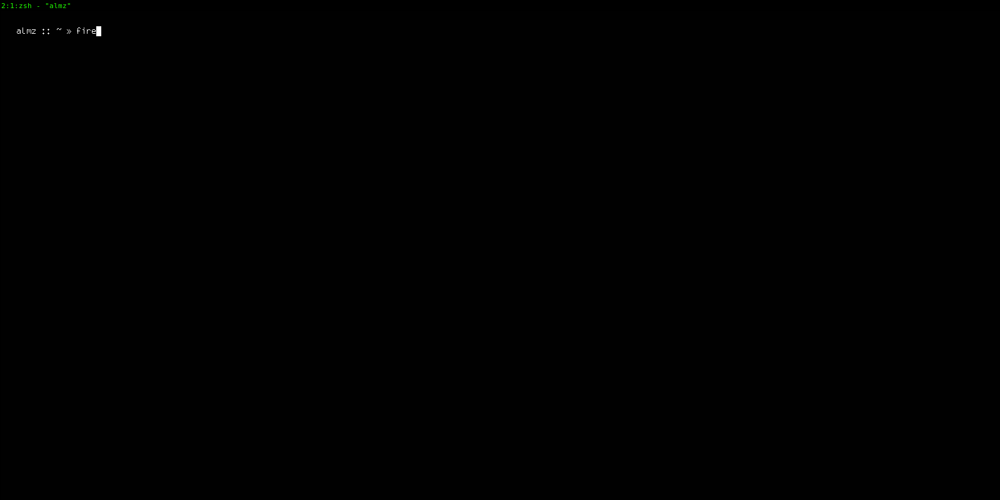

## Information

Material for the Spatial Part of the course "**_Advanced topics in single-cell transcriptomics_** 

**Date*** : 2020-05-30
**Teacher** : Alma Andersson

## Structure

* `data` - all data and files you need for this session
* `exercises` - jupyter notebooks and associated material
* `slides` - lecture slides
* `imgs` - images for repo


## Setup 
Before starting with the exercises, you need to decompress the data files. To do this : in your renku environment open a terminal window and `cd` into the `data` folder. Then simply do

```sh

gunzip -r *

```

For additional clarity, the animation below illustrate this procedure as well:




After this you should be ready to go! Open up the notebook called `Part 1` to get started.

